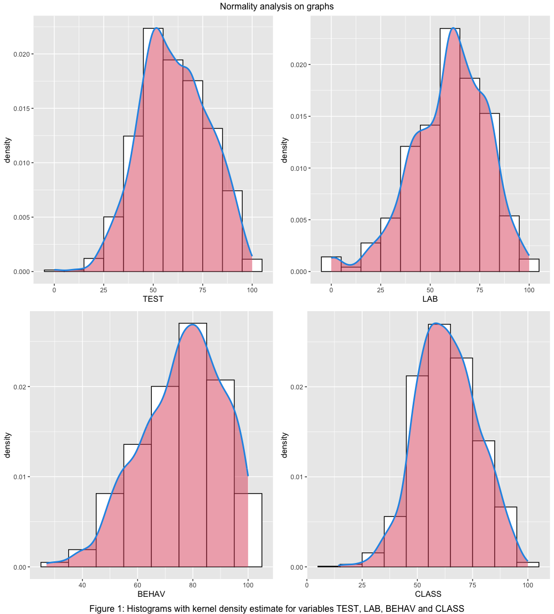

# DATA

The **Variables** are described in this next table.

|     VARIABLE     | Description                                                                                                                                                                              |
|:----------------:|------------------------------------------------------|
|        ID        | Identification entry row data                                                                                                                                                            |
|       DATE       | First Year of the school year period                                                                                                                                                     |
|      SCHOOL      | Categorical variable, 0 and 1, represent two schools, identified by 0 (till 2008) and 1 (after 2009, included)                                                                           |
|      GENDER      | Categorical variable, F and M                                                                                                                                                            |
| TEST, LAB, BEHAV | Score variables in the tests and observational forms at TEST (Learning transfer), LAB (Laboratory practical skills assessment) and BEHAV (Social skills and school rules accomplishment) |
|      GRADE       | categories 0 to 6, representing, respectively, 7,8,9,10,11, 10 p (Technical) and 11p (Technical) grades                                                                                  |
|      M4CID       | Categorical 0 and 1 variable, respectively, without 4C/ID and with 4CID                                                                                                                  |
|      CLASS       | Continuous variable, 0 to 100, height average [^readme-6]                                                                                                                                |
|       RANK       | Categorical variable, 1,2,3, that measures the adaptability of students to school: 1 less adapted, 3, more adapted.                                                                      |
[^readme-6]: CLASS = 0.5 x TEST + 0.3 x LAB + 0.2 x BEHAV

Table 1: variable description

Table 2 and 3 shows a short **descriptive statistics** summary of the samples for school 0 and 1, and the entire sample with the main variables (they are described below), respectivley. This is a longitudinal sample with 1414 rows (observations). It covers 12 years of data, from 2003 to 2017. In this data there are two changes. In 2009 there is a school change to a different region: the first is a junior school, identified by SCHOOL = 0, and the second has Junior and a Junior High students. In 2012 the change that is crucial here, going to an inductive strategy. So the treatment group is the sample after 2012, included. Table 1 shows a first data description for school 0 and 1: 476 observations (34%) and school 1, 938, 66%. About GENDER, the global sample is not balanced: 602/812, 43%/57%, respectively, female and male. Almost the same about the treatment and control group percentage: 828, 59%; with 4CID: 586, 41%. Conclusion: From this analysis it seems to be possible comparing not only all the sample but also, just the Junior: this sample is more balanced in terms of grades and gender. The secondary is not balanced but it can be used fro global sample inference. Junior sample its a better one.

| GRADE | Obs. | %  | Notes |
|:---:|:---:|:---:|:---:|
| 0 (7th) | 353 | 25% |
| 1 (8th) | 411 | 29% | 
| 2 (9th) | 396 | 28% |
| 3 (10th) | 27 | 2% |
| 4 (11th) | 18 | 1% |
| 5 (10technical) | 117 | 8% |
| 6 (11technical) | 93 | 7% |

Table 2: distribution by grade 

| Variable | Obs. | Mean | Median | Min.| Max. | St. Deviation | Notes |
|:---:|:---:|:---:|:---:|:---:|:---:|:---:|---|
| TEST | 1414 | 61 | 60 | 0 | 100 | 17 |  |
| LAB | 1414 | 60 | 60 | 0 | 100 | 19 |  | 
| BEHAV | 1414 | 76 | 77 | 27 | 100 | 15 | |
| CLASS | 1414 | 64 | 63 | 14 | 100 | 14 | |

Table 3: schools descriptive data sample

Looking to table 2, its clear that sample variables cover a wide range of the possible values and the means and medians are very close, this can be a clue about data normality. But, further inference analysis shows that it is not the case: samples are skewed and have heavy tails: big values of the standards deviations. Figure 1 shows the non-normal samples for each variable for the global sample. Shapiro tests show low p-values << 0.05, which means that there is a 95% sure to reject the null: they are not similar to the normal distribution. 

| M4CID 0 | Obs. | Mean | Median | Min.| Max. | St. Deviation | Notes |
|:---:|:---:|:---:|:---:|:---:|:---:|:---:|---|
| TEST | 828 | 62 | 62 | 16 | 100 | 17  |  |
| LAB | 828 | 57 | 60 | 10 | 100 | 20  |  | 
| BEHAV | 828 | 77 | 79 | 28 | 100 | 14 | |
| CLASS | 828 | 64 | 64 | 14 | 97 | 14 | |

| M4CID 1 | Obs. | Mean | Median | Min.| Max. | St. Deviation | Notes |
|:---:|:---:|:---:|:---:|:---:|:---:|:---:|---|
| TEST | 586 | 58 | 57 | 0 | 100 | 17 |  |
| LAB | 586 | 64 | 65 | 15 | 100 | 16  |  | 
| BEHAV | 586 | 74 | 76 | 27 | 100 | 16 | |
| CLASS | 586 | 63 | 62 | 18 | 100 | 14 | |

Table 4: data from the treatment and control group

Both groups, treatment and control are well balanced: without 4C/ID 828, 51%; with 4C/ID: 797, 49%. We notice that are very low observations numbers sample entries levels for Junior High, 24%. It seems that it will be better to use the junior sample for the research: this is a more balanced sample in terms of observations and gender. The treatment and control group in the Junior High sample its poorly balanced and the observations are very low, in particular, to the 10 and 11th grades: just 8% of the data are observations of the control group, 92% for the treatment group.

Figure 2 shows the variable longitudinal patterns for all sample box plots time series, which includes junior and junior high students data for both schools. The red vertical line shows the school change and the blue one is the starting point for the implementation of 4C/ID strategic inductive methodology for the treatment group. Its clear that near each vertical line there is a change showed by the blue smooth line (polynomial local regression). So, something happened! 

Furthermore, it seems that there no positive effect of the methodological change and its clear that there is a school effect, meaning that, the schools have different learning outcomes.

# NOTES

data sources
data treatment
Struture of the data
variable definitions
Summary stats
Interesting facts

The **DATA** gathered for this works integrated 16 years, time period 2003-2019 (with some gap years) and is a real day-to-day teacher struggling to motivate and engage student in knowledge. Two learning strategies are used: deductive and inductive. The first focuses on the direct instruction traditional methodologies, the later on the 4C/ID instruction design proposed by Merrionboer??? in a bLearning environment as well. This work compares learning data gathering from students at the junior level, in the discipline of Physics and Chemistry, in the Portuguese curriculum context. 

This work compares data from student school results, specifically on the Physics and Chemistry subject: learning transfer and observational in class assessment registering, for primary and secondary education levels, over 14 years (from 2003 to 2017), graded in percentage (from 0 to 100 %). During this time period the educational methodology changed (see section Introduction, Methodologies: changing over time) toward inductive and a bLearning environment.

So, it's a longitudinal study, with time serial data, with three variables: ID, GRADE, GENDER, TEST, LAB, and BEHAV (see section bellow, Variable Definition). There are three added variables, one is RANDOM, CLASS, and RANK. The first one is just to be aware that the process represented by this data is not RANDOM, they have a distribution, and so, something is happening, it's real. CLASS is used to calculate a weighted average (CLASS=0.5*TEST+0.3*LAB+0.2*BEHAV) in order to define a student RANK: this intended to represent the levell of adaptation of students to the school.

- Data as a overall 1157, but the sample used for the final conclusions were restricted to 683 entrances and 14 variables, ID, included, where RANDOM, CLASS, and RANK are calculated. 
- Students are from grades 7,8,9,10 and 11, identified in the data by 1,2,3 respectively (note: during the analysis students from 10 and 11 grade were removed): 
  - 25% are from grade 7; 
  - 34% from grade 8; 
  - 30% from grade 9.48% of the students are females. 
  - 42 % of the data are from classes where there was application of 4C/ID method. 

########## Resume
# The student data came from two different school: until 2008 school 0, after that, school 1, until 2019;
# School 0 has junior grades, 7 to 9th grade
# School 1 has junior grades and junior high with general courses and professional/technical coourses
# Male is represented by M and female by F
# with 4CID, varable M4CID = 1, otherwise M4CID = 0;
# Grades 7,8,9, 10, 11, 10P (technical), 11P (Tecnical) are categorizes by 0 to 6, respectively;
# Total sample data lenght 1625;
# female/male sample: 641/984, 39%/61%: no balanced GENDER; JUNIOR balanced: 49% Female, 51% male;
# Junior - 1235
# SCHOOL 0 Junior - 476 (29% for the global sample, 39% for the junior all sample)
# SCHOOL 0, 476, 29%
# SCHOOL 1 - 1149, 71%
# SCHOOL 1 Junior - 759 (61% for the junior all sample) 
# Junior High represents 390 entries, 24% all data sample
# Global Sample without 4CID: 931, 57%; 
# Sample with 4CID:694, 43%: more data with 4CID methodology: unbalanced but not critical
# SCHOOL 0 Junior , 7 to the 9th grade: - with 4CID 0 (0%); without 4CID 476 (39%) ???
# SCHOOL 1 Junior , 7 to the 9th grade: - with 4CID 365 (30%); without 4CID 394 (32%) ???
# SCHOOL 1 Junior High, 10 to the 11th grade: - with 4CID 329 (84%); without 4CID 61 (16%) 

# Conclusion: From this analysis it seems to be possible comparing not only all the sample but also,
# just the Junior or just the secondary, but in the secondary there is only 61 entrances without 4CID;
# as well as by each grade on the junior level
# conclusion: Junior sample entries and gender percentagem well balanced

#variables description
#ID: Identification entry row data;
#DATE: year of the sample: it belongs, actually to 2003/2004, lective year;
#SCHOOL: there are two schools, identified by 0 (till 2008) and 1 (after 2009);
# GENDER: F and M
#TEST, LAB, BEHAV: variables of the score in the tests and observational forms at LAB (Laboratory practical skills assessment)
# and BEHAV related to accomplishement school rules behavior
# LAB work and Behavior, normally if they follow the rules stablished at school
# GRADE: categories 0 to 6, representing, respectively, 7,8,9,10,11, 10p(techical) and 11p (Technical) 
# M4CID, category 0 and 1, respectively, without 4C/ID and with 4CID;
# CLASS, 0 to 100, height average, CLASS=0.5*TEST+0.3*LAB+0.2*BEHAV: 
#this will be used in a variable to be defined below, RANK: a study for student addaptation to the school system

> Data from 2008 to 2012 is not used: in those years there was a transition. So, I considered that only after 2013, the inductive methodology was sufficiently mature. There are also some data gaps, namely, 2007, 2015, and 2018, corresponding to teacher gap years for reasons of scholarships or same work outside the school.

> After some discussion (see section results) the data effectively used in the results and conclusions is restricted to junior school (7,8 and 9th grades) for school 1, for both groups, with and without the 4C/ID methodology. The conclusons are based ont the variables already mentioned and defined in the next section. This sample as a 683 entries distributed like this:

|Group|Number|Percentage|notes|
|---|---|----|---|
|Female|326|48%||
|with 4C/ID|289|42%||

**Average grade student** for each variable, at school 1, with 4C/ID and without:

|Variable|Median/Average without 4C/ID|Median/Average with 4C/ID|Notes|
|---|---|---|---|
|TEST|54/56|60/60||
|LAB|53/51|66/66||
|BEHAV|82/80|74/72||
|CLASS|59/59|61/64||

> This results suggest a **preliminar conclusion**: some averall positive effect by looking at the CLASS variable and also, in the TEST and LAB variables, but a negative effect at the BEHAV variable. It seems that students behave worse with the inductive methodology.

## Rank averages with and without 4C/ID

|RANK|Number|%|TEST without/with|LAB without/with|BEHAV without/with|
|---|---|---|---|--|---|
|1|75|11|36/31|24/36|66/56|
|2|435|64|53/54|51/62|79/66|
|3|173|25|79/79|72/81|91/88|

> This results suggest that students categorized by RANK only benefit at the LAB variable, while they get worse in the BEHAV variable. Only 25% of the students addapt very well to the school.

## Variable Definition

|Variable|Description|notes|
|---|---|---|
|ID| data is identified with an entry number that doesn't have any special meaning; the data was introduced by date order.||
|DATE| In Portugal, the school year involves two years, from September to July of the next year: in this case, it was used the date of the first year as the reference of the data.|Example: school year, 2003/2004, the year used is 2003|
|SCHOOL|Schools are identified with numbers: there are only two schools identified by 0 and 1: 0 is the school from 2004 to 2008: the first with students from 7th to the 8th grade, D.João II, Caldas da Rainha, Portugal; the second, a larger school with grades from 7th to 12th (Madeira Torres Secondary School).|| 
|GENDER| M-male and F-Female.||
|TEST| classification in transfer tests |in percentage|
|LAB| classification in the lab experimental work, that involves reports and managing tool lab and following lab protocols: |also in percentage|
|BEHAV| Behavior in the classroom: students should follow school and teacher directives for classroom management and security procedures: percentage; |this data was gathered in-class observational sheets;|
|RANDOM| Random numbers;||
|CLASS| Classification using this weight average formula: CLASS=0.5*TEST+0.3*LAB+0.2*BEHAV; |in percentage|
|RANK| Students with CLASS less or equal to 55% are ranked with 0; Students with CLASS equal or bigger than 70% are ranked with 2, the rest with 1; |the ranked 0, are considered students that don't adapt well to the school, the ranked 2 are considerer very well adapted and the rest more or less adapted.|

## Descriptive Summary statistics
     
|Parameters|TEST|LAB|BEHAV|CLASS|RANK|RANDOM|
|---|---|---|---|---|---|---|
|Min.   | 11.00 |    0.0  |29.00|14.40|1|0|
|1st Qu.| 50.00 | 48.0  |66.00|54.50|1|28.00|
|Median |62.00 | 60.0  |78.00|63.60|2|53.00|
| Mean  |62.07 | 59.5 |76.21 |64.13|2.069|51.78|
|3rd Qu.| 75.00  |73.0  |88.00|73.60|3|76.00|
|Max.   |100.00  |100.0 |100.00 |98.70|3|100.00|
|Variable entries|683|683|683|683|683|683|

## Data Structure
# Normality
This sample data feature will be tested throught histograms, QQ-plots and Shapiro-Wilk normality test. Looking at figure 1 the only graph more close to the bell shape is the one for the variable CLASS. But the test show that all p-values are very small compare the p-value corresponding to the 95% confident interval under the null hypothesis, showed in the next table 1:

|DATA SAMPLE|variable|Test Statistics|p-value|Reject H0|
|---|---|---|---|---|---|
|overall data|TEST|W = 0.99013 |4.927e-09|yes|
|overall data|LAB|W = 0.97869|8.224e-15|yes|
|overall data|BEHAV|W = 0.9704 | < 2.2e-16|yes|
|overall data|CLASS|W = 0.9942 | 5.631e-06|yes|

So, the sample shows to be not normal.

Interesting facts, observations, problems (graphs???)
Behavior (BEHAV) after 2014 falls down very rapidly. Is it a major change in society, or is it only for gender or grade diferences????
Only 25% of the students addapt very well to the school.

