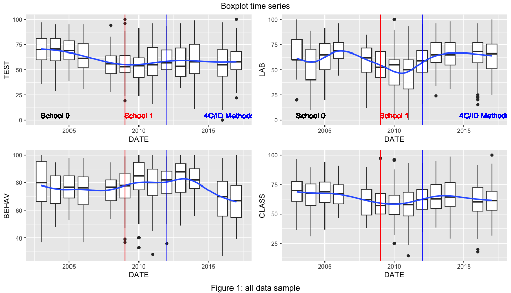

# WELCOME

This is a **`Going Inductive`** paper DRAFT roadmap[^readme-1], with one major goal, to share, worldwide, the work done. This **knowledge base source** contains the results, conclusions, procedures, exploratory data analysis (EDA), data (and raw data), statistical methods, educational methodologies, learning flow and bLearning practice. Hopefully, there will be, at least, one paper based on this.

[^readme-1]: This work, as well as the data, is also presented at the blog "<https://4cidchange.edublogs.org/>" and in the github repository <https://github.com/fqantonio/GoingInductive>.

>
> Education is the most powerful weapon which you can use to change the world. 
>
>                                                 Nelson Mandela

# ABSTRACT

Should you, as a teacher of science and tech of young students, **move to an inductive strategy**, for the learning design flow with all the activities chronologically organized, even if the setting is bLearning? In overall, the **answer is yes**, that is, 4C/ID eLearning setting has some advantages to Direct Instruction but with some remarks. If you decide to do it, there will be specific impacts that need to be **accommodated**, as well as implications for the stakeholders in the learning process: policy makers and school management. The sample covers 12 years of teacher data assessment, during the period 2003 to 2017, with conclusions about the impact in the Learning Transfer, Lab Practice, Social Skills and Academic Results.

**Keywords** Inductive learning strategy; 4C/ID; Direct Instruction; Learning Flow; Statistical Non-parametric Inference; academic results; learning transfer; behavior; lab practice; Cognitive Load Theory; Multi Intelligence Theory; Brain Based Learning; bLearning.

# GOALS, RESEARCH QUESTIONS and HYPOTHESIS

The **main goal** is to understand the impact of the use of Inductive Methodology Four Component Instructional (4C/ID) in a bLearning setting. That is, changing the learning methodologies from one mainly deductive, denominated by Direct Instruction (Merrill, 2007) to another one mostly inductive, Merriënboer's 4C/ID design theory (van Merriënboer, Kirschner, 2007), means what for students learning outcomes? Who benefits? What are the pros and cons about this methodological decision? What are the implications for the stakeholders?

The **hypothesis** is that this change will have a positive impact in all learning areas because, since it is based on the 4C/ID methodology that, in itself, is anchored on Brain Based Learning (BBL), Cognitive Load Theory (CLT), Multi-Intelligence Theory (MIT) and Multimedia Learning (ML).

# CONTEXT and DATA

This work is based on real day-to-day teacher assessment data, for junior and junior high students of two different schools, from different regions, for the chemistry and physics subjects of the Portuguese curriculum. This was gathered over 12 years, in the period 2003 to 2017, about students **Learning Transfer**, **Lab Practice**, **Classroom Behavior** (including Social Skills), and **Academic Results**..

The motivation lies on the need to understand the impact of the strategic decision within the educational work developed (flow charts, [^readme-2]): was it worth it? Did students benefit? What can be done better? What conclusions can be drawned? 

Most of the time the professional, specific, **day-to-day teacher work** data (see figure 2) is rarely or never investigated, at least, in the Portuguese educational environment. For the teachers, there is little or no time to look back and work through the data results, the qualitative remarks, or through the statistics. And, as a consequence, no robust conclusions are devised and worse, it's normal not to share it.

[^readme-2]: <https://cmap.ihmc.us/>

Figure 2 shows the variable longitudinal patterns for all sample using box plots time series, which includes junior and junior high students data for both schools. The red vertical line shows the school change and the blue one is the starting point for the implementation of 4C/ID strategic inductive methodology for the treatment group. Its clear that near each vertical line there is a change showed by the blue smooth line (polynomial local regression). So, something happened! 

# METHODS

The **statistical analysis** uses R code software in the RStudio[^readme-4] IDE release and the principal method is the non-parametric inferential treatment group effect. There is also a discussion towards the non-parametric regression inference, regression discontinuity design and clustering, just to have same feedback from other types of analysis that could show incoherence.

[^readme-4]: RStudio, <https://posit.co/products/open-source/rstudio/>

# RESULTS

Figure ??? is a resume of the **results**. In the y-axis it's shows the name of the samples and the x-axis the median differences for each sample in four variables: TEST, LAB, BEHAV and CLASS. The variables change, represented by colors (see legend), between treatment group and control group are presented on the left of the graph if there is a negative impact and in the right if there is a positive 4C/ID impact. Color vertical lines of each variable means that there is no change, that is, no 4C/ID impact.

# CONCLUSION

The conclusions presented here focus more on the more reliable and stable sample: junior sample of school 1. So, **Overall**, as a teacher of science and tech, you should (or at least think about it) move to implement the inductive strategy as your methodology for learning because it improves the **Learning Transfer**, **academic results** with a huge impact on **lab practice**, except for the **Social Skills** [^readme-8].

However, there are **risks and concerns** to be accommodated during the process, namely:
1. for the student less adapted to the school system;
2. the classroom management referring to students behavior (see discussion);
3. in the **learning transfer** process the gains are more modest;
4. males gain less with this change.

[^readme-8]: Is there an underlying behavioral underlying effect?

**Bottom line**, if you don't want to take the risks, change conditional to have a student group more adapted to school or if you want to increase the lab practices skills. 

Futhermore, this work shows is that there is a slight advantage of using 4C/ID eLearning setting compare to Direct Instruction. In fact, there is a huge advantage of 4C/ID in Lab Practice in spite of the negative impact in Social Skills. It also shows that the students that are less adapted to school don't improve much unless for the Lab Practice. So, compare with a instructional design with 200 years (???) of reliability is something to higlight.

# DISCUSSION

notes for discussion: - The conclusions meet the goals and answer th research question? - Did I implemented the methods correctly? - Is there an underlying effect for the behav variable? - Conclusions for the stakeholders in the learning process: teachers, Policy implications and school management. - blearning change: team work impressible - Reiterate results - world research corroboration ; Future research Tie loose hands: Clarify, robustness; after 2015 there is a crash in the student behavior skills.: need extra data; social skills: all, ranks, grades, and gender follow the same pattern? students behavior effect

  ## NOTES and OBSERVATIONS
  ## Policy implications
  ## Future  arch
  ## Tie loose hands together
  # DOUBTS AND DISCUSSIONS
  ########## doubts and discussions
# 802!?!?!? - scale change
#Kendall correlation test, sometimes because of the random sample it gives results of depency...
#what to ? a for cycle and calcula probability of getting independency?
#rank 1, kendall ties!?

# NOTES
