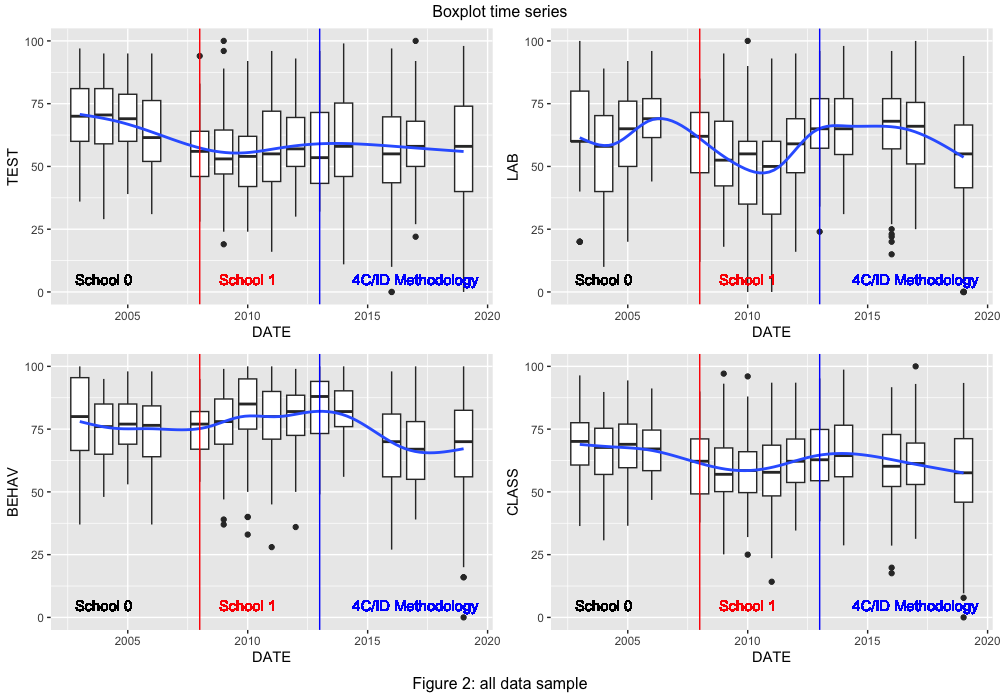
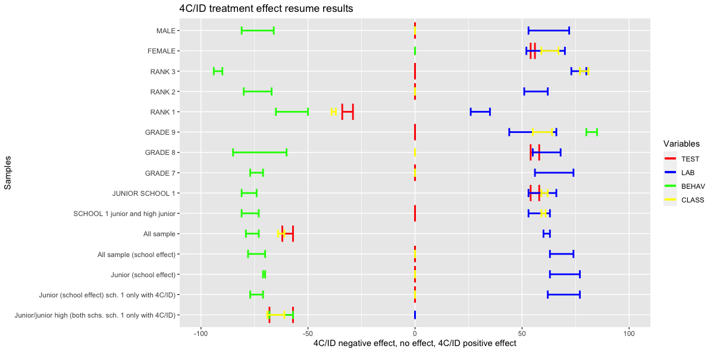

# WELCOME

This is a **`Going Inductive`** paper DRAFT roadmap[^readme-1], with two major goals: show the conclusions and share the work worldwide the work done: this is a **knowledge base source**, with the results and conclusions, procedures, exploratory data analysis (EDA), data (and raw data), statistical methods, educational methodologies, learning flow and bLearning practice. Hopefully, there will be, at least, one paper based on this.

[^readme-1]: This work, as well as the data, is also presented at the blog "<https://4cidchange.edublogs.org/>" and in the github repository <https://github.com/fqantonio/GoingInductive>.

> Education is the most powerful weapon which you can use to change the world. Nelson Mandela

# ABSTRACT

Should you, as a teacher of science and tech of young students, **move to an inductive strategy**, for the learning activities design flow, that you prepare and organize, even if you include bLearning? In overall, the **answer is yes**, but with some remarks. If you decide to do it, there will be specific impacts for the students that need to be **accommodated** as well implications for the stakeholders in the learning process: policy makers and school management. The sample covers 13 years of teacher data assessment, during the period 2003 to 2019, with conclusions about the impact in the learning transfer, Lab Practice, classroom behavior and academic results.

**Keywords** Inductive learning strategy; 4C/ID; Direct Instruction; Learning Flow; Statistical Non-parametric Inference; academic results; learning transfer; behavior; lab practice; Cognitive Load Theory; Multi Intelligence Theory; Brain Based Learning; bLearning.

# GOALS, RESEARCH QUESTIONS and HYPHOTESIS

The **main goal** is to understand the impact of the use of Inductive Methodology four component instructional (4C/ID) in a bLearning setting, by answering the following **research questions**:

1 - changing the learning methodologies from one mainly deductive, denominated by Direct Instruction (Merrill, 2007) to another one mostly inductive, Merriënboer's 4C/ID design theory (van Merriënboer, Kirschner, 2007), means what for students learning outcomes? Who benefits? What are the pros and cons about this methodological decision?

2 - Should you, as a teacher of science and tech, move to implement the inductive strategy as your methodology for learning?

3 - And if you do, what are the outcomes? What are the risks? What were the consequences for the student's academic results?

4 - Is there a different impact between female and male?

5 - And within the different grades?

6 - Student more adapted to school have benefit more with the use of 4CID methodology?

The **hypothesis** is that this change will have a positive impact in all learning areas because, in overall, it is based on the 4C/ID methodology: that, in itself is anchored on Brain Based Learning (BBL), Cognitive Load Theory (CLT), Multi-Intelligence Theory (MIT) and Multimedia Learning (ML).

# INTRODUCTION

The work presented here deals with the impact of changing from a mostly deductive type of methodology to a mostly inductive one: more precisely, this means a major change from a, **direct instruction** (Merril, 2007) classroom setting to an inductive strategy, **four components instructional design** (4C/ID) (Van Merrienboer, Clark, Coock, 2002), in a bLearning environment (Mayer, 2005). This leads directly to a major and crucial teacher concern that transform into the main **research question**: what are the accommodations, risks and concerns about the impact on students learning that you have to deal, if you make this strategic change?

Since this is a longitudinal data sample, Junior and junior high for the physics and chemistry content of the Portuguese school curriculum, the **conclusions** extrapolation should be used carefully.

The data used in this work was gathered over 13 years, in the period 2003 to 2019, from actual teacher day-to-day practice assessments about students **Learning Transfer**, **Lab Practice**, **Classroom Behavior**, that include Social Skills, and **Academic Results**. After starting to be interested about the different ways students lear I came across with the work of Felder´s learning styles (Felder; Silverman; 1988) and Wiley's Learning Objects (Wiley, 2002). These paper's showed me a complete list of different methodology that seems very promising and more adapted to the way brain learns. Furthermore, the readings about alternative **educational methodologies** went on also into the Cognitive Load Theory (Sweller, 1998), Brain Based Learning[\^2] (Jensen, 2005), Gardner Multi-Intelligence Theory (Gardner, 2011) and four component instructional design (4C/ID) (Van Merrienboer, Clark, Croock, 2002). After four years of readings and tests, in 2013 the 4C/ID methodology was applied and a bLearning environment online set with MOODLE Learning Management System (LMS) (Rice, 2006) lessons that were mostly accomplished in the classroom: fewer logs into the system were from outside.

# CONTEXT

This work includes junior and junior high students of two different schools data, from different regions, for the chemistry and physics subjects of the Portuguese curriculum, in the time scale 2003 to 2019. Raw data was gathered during 13 years, from actual day-to-day assessment registering in three different areas: transfer tests, lab practice and classroom behavior.

Figure 1 show the variable longitudinal patterns for all sample time series, which includes junior and junior high students data for the two schools. The red vertical line shows the school change and the blue one is the starting point for the implementation of 4C/ID strategic inductive methodology for the treatment group. Its clear that near each vertical line there is a change showed by the blue smooth line (polynomial local regression). So, something happened! Furthermore, it seems that there no positive effect of the methodological change and its clear that there must be a school and behavior effect. Meaning that, the schools have different learning outcomes and after 2015 there is a crash in the student behavior skills.

The concept map's software cmap tools[^readme-2] was used for the design of the learning flow maps and they are presented online[^readme-3] showing the four components and the structure based in the four component instructional design (4C/ID), described in the book *Ten Steps to Complex Learning* (van Merriënboer; Kirschner, 2007).

[^readme-2]: <https://cmap.ihmc.us/>

[^readme-3]: Flow charts (missing details to be updated) Data base sample (R data frame): <https://cmap.ihmc.us/> ;

The **statistical analysis** uses R code software in the RStudio[^readme-4] IDE release and starts with a exploratory data analysis (EDA): a descriptive summary of the quantitative data and several plots showing patterns and relationships between variables. Afterwards there is a data normality and sample independence investigation. The principal methodology used is the non-parametric inferential treatment effect, but there is a discussion towards the non-parametric regression inference, regression discontinuity design and clustering. this last ones just to try to corroborate the upper first results. For this, it was used a data base[^readme-5] and 3 learning outcomes variables: transfer learning, laboratory practice and social skills, addressed respectively by 3 variables, TEST, LAB and BEHAV. The CLASS variable is directly related to the academic results and is a weigth average of TEST, LAB and BEHAV. TEST, LAB and BEHAV were assessed by paper transfer tests, online transfer tests and in classroom observational paper registering forms.

[^readme-4]: RStudio, <https://posit.co/products/open-source/rstudio/>

[^readme-5]: there was a need to make some analysis of this data sample group in order to conclude if there is an underlying school effect: in fact there is a difference confirmed with 95% confidence. <https://github.com/fqantonio/GoingInductive/tree/main/DATA>

The **Variables** are described in this next table.

|     VARIABLE     | Description                                                                                                                                                                                                                                                                                                                                                      |
|:--------------:|--------------------------------------------------------|
|        ID        | Identification entry row data                                                                                                                                                                                                                                                                                                                                    |
|       DATE       | First Year of the school year period                                                                                                                                                                                                                                                                                                                             |
|      SCHOOL      | Categorical variable, 0 and 1, represent two schools, identified by 0 (till 2008) and 1 (after 2009, included)                                                                                                                                                                                                                                                   |
|      GENDER      | Categorical variable, F and M                                                                                                                                                                                                                                                                                                                                    |
| TEST, LAB, BEHAV | Variables of the score in the tests and observational forms at LAB (Laboratory practical skills assessment) and BEHAV related to accomplishment school rules behavior LAB work and Behavior, normally if they follow the rules established by the school; GRADE: categories 0 to 6, representing, respectively, 7,8,9,10,11, 10p (Technical) and 11p (Technical) |
|      M4CID       | Categorical 0 and 1 variable, respectively, without 4C/ID and with 4CID                                                                                                                                                                                                                                                                                          |
|      CLASS       | Continuous variable, 0 to 100, height average [^readme-6]                                                                                                                                                                                                                                                                                                        |
|       RANK       | Categorical variable, 1,2,3, that measures the adaptability of students to school: 1 less adapted, 3, more adapted.                                                                                                                                                                                                                                              |

[^readme-6]: CLASS = 0.5 x TEST + 0.3 x LAB + 0.2 x BEHAV

# MOTIVATION

Most of the time the professional, specific, **day-to-day teacher work** data is rarely or never investigated, at least, in the Portuguese educational environment. For the teachers, there is no time to look back and work through the data results, the qualitative remarks, or through the statistics. And, as a consequence, no robust conclusions are possible. Worse, even if someone does it, it's normal not to share it.

My **personal motivation** is to know if the strategic decisions I did in 2008 were positive for my students: did they benefit from the educational strategic change? It was a global benefit or some groups benefited more? Does anyone have the same kind of research for comparition? Can anyone corroborate this results or criticize them? Sharing is the way to go to find knowledge.

# RESULTS

Figure 2 and the next table present a resume of the **results**. The values showed represent changes in the variables median.

The next table resumes the former graph in another order: it shows the percentage of "positive", "negative" and "no effects", detected for each sample.

| Variable                 |  \+  | \~  | \-  |                SAMPLE +                 |       no effect sample        |                SAMPLE -                 | Notes |
|---------|:-------:|:-------:|:-------:|:-------:|:-------:|:-------:|---------|
| TEST (Learning Transfer) | 33%  | 56% | 11% | All Junior sample, 8th grade and FEMALE |          GRADE 7, 9;          |                  RANK1                  |       |
| LAB (Lab practice)       | 100% | 0%  | 0%  |               all samples               |                               |                                         |       |
| BEHAV (behavior)         | 11%  | 11% | 78% |                 GRADE 9                 |            FEMALE             | Junior; GRADE 7 and 8; all RANK's; MALE |       |
| CLASS (academic results) | 22%  | 45% | 33% |        junior; 9th grade; FEMALE        | grades 7 and 8; RANK 2 e MALE |              RANK 1 and 3               |       |

# CONCLUSION

(need more editing ;) )

The conclusions presented here focus on the junior sample of school 1 (table above).

**Overall**, as a teacher of science and tech, you should (or at least think about it) move to implement the inductive strategy as your methodology for learning because it improves the **academic results** with a huge impact on **lab practice**.

However, there are risks and concerns to be accommodated during the process, namely:

1.  the less adapted to the school system;
2.  the classroom management referring to students behavior;
3.  in the **learning transfer** process: there must be some additional activities planned to accommodate this loss;
4.  Grade 7 and males, in less degree of concern, seems to benefit less from this change.

**Bottom line**, if you don't want to take the risks, change conditional to have a student group more adapted to school and if you want to increase the lab practices skills.

RISKS:

1.  In the **learning transfer** and **academic results** learning areas, there is the risk that the less adapted to the school environment have a decreased with this strategic change;

2.  For **behavior**, specifically in the aspect of following social and behavioral classroom rules, there is a major negative [\^6] impact in all samples: the risk of loosing control of the students group inside the classroom is real; however, but note that, although, the assessment were all positive: median change from 81 to 74%, which means that the behavior was above 50% and didn't represent a thread to the classroom learning environment.

CONCERNS:

1.  There seems to be a positive effect only in GRADE 8 and FEMALE groups for the **learning transfer**: the changes in the other groups don't have any effect.

2.  On the **behavior field** only grade 9 seems to get some positive effect;

3.  In general, Female gender group tend to benefit more them male;

4.  In general, RANK 3 tends to benefit more then the other rank groups;

5.  grade 9th benefit more then the other grades;

BENEFITS:

1.  In overall, the change has a positive impact on junior grade students for the **academic results**;

2.  **Lab practice** has a large positive effect in all samples.

# DISCUSSION

notes for discussion: - The conlsuions meet the goals and answer th research question? - Did I implemented the methods correctly? - Is there an underlying effect for the behav variable? - Conclusions for the stakeholders in the learning process: teachers, Policy implications and school management. - blearning change: team work impressible - Reiterate results - world research corroboration ; Future research Tie loose hands: Clarify, robustness; after 2015 there is a crash in the student behavior skills.: need extra data

# KEYWORDS

**`Inductive learning strategy`** - the learning flow starts by facts, experiences and real problems and move towards knowledge and a conceptual mental model;

**`4C/ID`** - instructional design approach for complex learning. It provides guidelines for the analysis of real-life tasks and the transition into a blueprint for an educational program.

**`Direct Instruction`** - Principles of Instruction that prescribe a cycle of instruction consisting of activation, demonstration, application, and integration (Merril, 2007);

**`Learning flow`** - longitudinal (temporal) map with sequenced activities organized in time, by complexity and loical learning coherence;

**`Statistical Non-parametric Inference`** - statistical techniques that use data to test if two sample came from the same non-normality distribution;

**`Learning transfer`** - the ability of pass information to the students measured by tests (online or paper supported), directly related to the TEST variable

**`Lab Practice`** - Laboratory activities directly related to the variable LAB

**`Behavior`** - Ability to follow social and behavioral classroom rules directly related to the BEHAV variable.

**`Academic results`** - weight average variable directly related to the variables: TEST, LAB and BEHAV: $$ CLASS = 0.5 \times TEST + 0.3 \times LAB + 0.2 \times BEHAV $$.

**`Cognitive Load Theory`** - Cognitive load theory provides empirically-based guidelines that help instructional designers decrease extraneous cognitive load during learning and thus refocus the learner's attention toward germane materials, thereby increasing germane (schema related) cognitive load. This theory differentiates between three types of cognitive load: intrinsic cognitive load, germane cognitive load, and extraneous cognitive load;

**`Multi Intelligences Theory`** - Multiple intelligences refers to a theory describing the different ways students learn and acquire information. These multiple intelligences range from the use of words, numbers, pictures and music, to the importance of social interactions, introspection, physical movement and being in tune with nature;

**Multimedia Learning** - Set of principles based on scientific evidence for learning from words (spoken or printed) and pictures (video, graphs, illustrations, map or photos)

**`Brain Based Learning`** - refers to teaching methods, lesson designs, and school programs that are based on the latest neurologic scientific research about how the brain learns;

**`bLearning`** - Means Blended learning for education combines classroom-based learning with distance learning (eLearning).

# REFERENCES

Felder, Richard M. ; Silverman, Linda K.; (1988), Engr. Education, 78(7), 674--681;

Gardner, Howard (2011) Frames Of Mind: The Theory Of Multiple Intelligences, ISBN-13: 978-0465024339;

Jensen, Eric (2005); Teaching with the Brain in Mind, ASCD, ISBN-10: 146600302; ISBN-13:978-1416600305

Mayer, Richard (editor)(2005); The Cambridge Handbook of Multimedia Learning, Cambridge University Press; ISBN: 0-521-83873-8;

Merrill, M. David (2007) A Task-Centered Instructional Strategy, Journal of Research on Technology in Education, 40:1, 5-22, DOI: 10.1080/15391523.2007.10782493

Van Merrienboer, Jeroen J. G. & Clark, Richard & Croock, Marcel. (2002). Blueprints for complex learning: The 4C/ID-model. Educational Technology Research and Development. 50. 39-61. 10.1007/BF02504993. <https://github.com/fqantonio/GoingInductive>

van Merriënboer, Jeroen J. G.; Kirschner, Paul A.; (2007) Ten Steps to Complex Learning, Routledge; 1st edition, SBN-10:0805857931; ISBN-13:978-0805857931;

Rice, William (2006); Moodle, E-Learning Course Development, Packt Publishing, ISBN: 1-904811-29-9;

Sweller, John et al. (1998) "Cognitive Architecture and Instructional Design." Educational Psychology Review 10 (1998): 251-296;

Wiley, David A. (Editor) (2002) The Instructional Use of Learning Objects, Agency for Instructional Technology Association for Educational Communications & Technology; First Edition; ISBN: 0-7842-0892-1;

# NOTES
