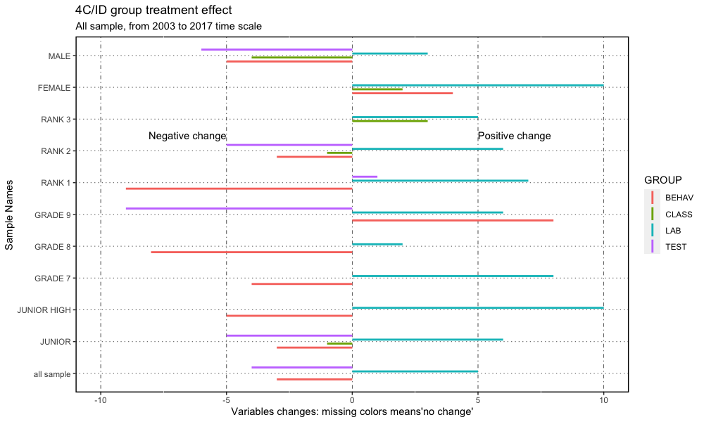

> 
>    Education is the most powerful weapon which you can use to change the world.
>
>         
>                                            Nelson Mandela
> 

# WELCOME

This is a **`Going Inductive`** learning educational strategy changing paper DRAFT roadmap[^readme-1], with one major goal: to share the work done about the impact of a educational strategic change: from Direct Instruction to Four Components Instructional Design (4C/ID).

[^readme-1]: This work, as well as the data, is also presented at the blog "<https://4cidchange.edublogs.org/>" and in the github repository <https://github.com/fqantonio/GoingInductive>.

This **knowledge base source** contains the results, conclusions, procedures, exploratory data analysis (EDA), data (and raw data), statistical methods, educational methodologies, learning flow and bLearning practice. Hopefully, there will be, at least, one paper based on this.

# ABSTRACT

Even though the research about the impact of using specific methodologies or educational procedures is well developed, this work analyses an educational strategic change impact: from deductive to inductive methods (Felder,1993). This paper argues that you should, as a teacher of science and tech of young students, **move to an inductive strategy**, for the learning design flow, in a bLearning setting. In fact, overall, 4C/ID bLearning methodology doesn't provide an overwhelming advantage over Direct Instruction, mostly because of the sample underlying effects, however it is possible to claim with some robustness, under the set of several sample results, that for Lab Practice, there is a major positive impact. For school success and learning transfer there is a less positive effect and a widespread negative impact for social skills. Groups that benefit more are female, grade 9, junior high and the students more adapted to school. Those who don't benefit so much are males and students less adapted to school.

So, if the decision is taken, there will be specific impacts that need to be **accommodated**, as well as implications for the stakeholders in the learning process, policy makers and school management. All of those will be adressed here.

The sample covers 12 years of teacher data assessment, in the period 2003 to 2017, with conclusions about the impact in the Learning Transfer, Lab Practice, Social Skills and Academic Results.

> **Keywords** Inductive learning strategy; 4C/ID; Direct Instruction; Learning Flow; Statistical Non-parametric Inference; Learning Transfer, Lab Practice, Social Skills and Academic Results; Cognitive Load Theory; MultiIntelligence Theory; Brain Based Learning; bLearning.

# GOALS, RESEARCH QUESTIONS and HYPOTHESIS

The **main goal** is to understand the impact of changing from Direct Instruction (Merrill, 2007) to Merriënboer's Inductive Methodology Four Component Instructional (4C/ID) (van Merriënboer, Kirschner, 2007) in a bLearning setting using MOODLE as a Learning Managment System (LMS)(Cole, 2005)(Rice, 2006). 

This analysis spread out in four learning outcomes areas, Learning Transfer, Lab Practice, Social Skills and Academic with this **research questions** guiding the process: what is the impact for the students learning outcomes? Who benefits more? What are the pros and cons about this methodological strategic decision? What are the implications for the stakeholders?

The **hypothesis** is that this change will have an overall positive impact in the learning outcomes mentioned, because it's based on the 4C/ID methodology **'brain friendly'**, anchored on Brain Based Learning (BBL)(Jensen, 2005)(Sylvester,1995), Cognitive Load Theory (CLT)(Plass, Moreno, Brünken, 2010), Multi-Intelligence Theory (MIT)(Gardner, 2011) and Multimedia Learning Principles (MLP)(Mayer, 2005), learning theories well established. Adding to this there is a robust research and development linking the Cognitive Architecture and Instructional Design, bringing the Neuroscience research principles more near the educational settings (Sweller, 1998). Other examples of this are the MLP and CLT refered before. For the stakeholders it will give some guidelines for better support the teaching work, not only in efficiency but also in the learning design and strategies implementation (Kirschner,2002).

# THEORY and PROCEDURE (work in progress)
The framework of this paper consider learning as the transfer of information and schema knowledge structures into the long-term memory, folowing the work of John Sweeler (see is interview to the Knowledge Society CEO, Elena Douglas in 2023, available on Youtube): learning always involves integrating new information with existing knowledge structures, also meaning, the aquisition and automation of schematics knowledge (Paas et al., 2010, p.51). Schemas means patterns of stable relationships between stored knowledge, building new schematic knowledge using old ones in the long-term memory (Plass et al., 2010, p.38). So, effective instructional methods should always be tuned up to the students existing schematic knowledge base to minimize processing loads of working memory (Paas et al., 2010, p.51).

Sweller (Plass et al., 2010, '.35) resume all of this: "CLT is concerned with how information held in long-term memory of instructors can be borrowed for use by learners via schema aquisition".

All the theories underlying this work, from BBL to MI, are resumed on CLT and, finnaly on the 4C/ID that provide a clear procedure, used in this work, as a reference lighthouse, that considerer the way humans process information and how the cognition mind works. From CLT it was considered the very basic strategy of taking care of the **amount of information and cognitive load** (Kalyuga in Plass el al., 2010, p.50) within each online and presential activity: the intrinsic, the extraneous and germane loads are concepts to be aware in the process of preparing and using the educational materials. Added to this was also the strategy of **gamification**: putting levels of achievement and **feedback** that took the learner in a learning path that considerer the knowledge mastered: expertive reversal effect, (Plass et al., 2010, p.96). **Worked-Out-examples** was one of the strategies implemented as well as, **self-explanations** and **faded work-out steps**. 

Non of this was addapted to students prior knowledge nor **germane load** was considered. **Prior knowledge** also was not considered in detail but only in the usual broader sense where students that attend the class completed the previous grade. 

A central idea, already mentioned, is the mental model aquisition that is accomplished by the Kalyuga (Plass et al. 2010, p.56) schema aquisition procedure which is very hard to achieve in every learner whatever student in whatever content. So, schema aquisition need **automation** in order to get to higher order of expertise reducing cognitive load. So, small chunks of activities where put in place in order to construct the higher order knowledge puzzle. Included were also the **multimedia principles** of dual information in video and media presentations. In all of the activities the **guidance** was always provided along with fading until students where able to solve the problem autonomously. 

**Principles** like the direct initial instruction principle and the small step-size of knowledge principles were taking in account but not the expertise principle, mostly because, only in same exceptions, students of a higher degree of understanding of the content were attending this intended novice lectures. Of course, the information store principle (the cognitive system has a large store of information, the long-term memory); borrowing and reorganizing principle (almost all information in long-term memory was borrowed from other long-term memory and aquired by imitation), listening or reading; in a schema theory the learner don't remember everything but the knowledge is soterd in a schema struture: learning also includes the aquisition and automation of schema using; automation of lower level schema is needed for the high levell schema aquisition. Randomness as genesis principle is for comunicating information only, it does indicates that random generation of information followed by test of effectiveness provide the initial source of generation of all the information in the long-term memory; meaning, when face with a new problem random generation of activities moves forward by tests of effectiveness; Change principle, meaning, all changes in long-term memory ocurr slowly and incrementally (wroking memory limitations): so, we can conclude that learners producing information is inefective. Finnaly, organizing and linking principle: unlimited organized long-term memory can be used for the interactions with the natural world. Added to this prinicple was the variation of contexts of the problems proposed. Multimedia principles were not forgeted, not only in the video editing but also in the animation interactiv films and simulations produced and organized by PHET animations and LMS Lesson MOODLE activity. Namely, guided activity, feedback, reflection principle (plass et all, p.166) and multimedia principle, already mentioned.

**In practice**, the prodedure underlying of the pedagogic planning, was the **4C/ID** of Merrionboer that provides a consistent means of managment of instructional sequences. This model provides the methodology for analysis of complex cognitive skills and development of appropriate sequences of whole-tasks learning situations that support gradual aqcquisition of these skills in a cognitively sustained manner. The procedure takes into account the limited processing capacity of working memory by gradually increasing the level of difficulty of whole tasks. According to this methodology, learning tasks for complex environments are organized in simple to complex sequence of task classe, with gradually dimishing levels of support within each class (scafolding). Suficient supportive information is provided for general aspects of learning tasks, and just-in-time information engage students in automation for the learning goals. Also part-time-task-practce is offered to train constituent skills that needed to be performed at a very high level of automaticity, Kalyuga (Pass et all, 2010). Moreover, this all methodoly also followed a concrete-to-abstract partner promoting the aquisition of higher level of conceptual schemas. 

**Shortly and resumedly**, from CLT theoretical structures, in the design of the bLearning activities, envolved mostly Worked example, completion, split-attention, modality, guidance, fading and interactiv elements in the classroom and in the LMS MOODLE. Students differences were indirectly considerer by the fact that the teacher had more time to follow and interact with the student while he/she was completing the bLearning tasks in the LMS.

The **procedure** taken for the instructional design of this bLearning enviroment setting was done with cmap tools ([My Cmaps Cloud](https://cmapcloud.ihmc.us/cmaps/myCmaps.html)). The maps conceived contains the 4C/ID theoretical structure in the first step that was developed after a first trial for a real but small learning structure which was used to reelaborate that theoretical setting that followed several feedback loops until that 4C/ID structure was clear to be used for a first real learning course. Of course, each time the 4C/ID cmap was used in a new course or learning content some adjustments were made but just with the idea of making easire a clearer the use of those theoretical 4C/ID maps. Those maps contains all the guides proposed by 4C/ID of Merriënboer, already embeded in the CLT theory, and they show the two main lines of work while using them: in time, with the broadening of practice, concrete activities towards concepts and conceptualization, new problems and contexts, with the idea of schema learning, step by step, in small amounts with supportive information; and down, meaning, showing the possible paths, fullfilled with just in time information, fading guidance, promoting procedure automation, into the increasing complexity of the subject.

# STATE OF THE ART (writing work about to start)

# CONTEXT and DATA

This work is based on real day-to-day teacher assessment data, for junior and junior high students of two different schools, from different regions and time periods, for the chemistry and physics subjects of the Portuguese curriculum.

The data was gathered over 12 years, in the period 2003 to 2017, and includes students **Learning Transfer**, **Lab Practice**, **Classroom Behavior** (Social Skills), and **Academic Results** using four different random variables: TEST, LAB, BEHAV and CLASS.

The **motivation** lies on the need to understand the impact of the professional strategic decision within the educational work developed (flow charts, [^readme-2]): 

> Was it worth it? Did students benefit? What can be done better? What conclusions can be drawned?

[^readme-2]: <https://cmap.ihmc.us/>

Most of the time the professional, specific, **day-to-day teacher work** data (see figure 2) is rarely or never investigated, at least, in the Portuguese educational environment. For the teachers, there is little or no time to look back and work through the data results, the qualitative remarks, or through the statistics. And, as a consequence, no robust conclusions are devised and worse, it's normal not to share it.

## Variables description

|     VARIABLE     | Description |
|:----------------:|-------------------------------------------|
| ID | Identification entry row data |
| DATE | first year of the raw sample: example: 2003/2004, lective year, is recorded as 2003 |
| SCHOOL | there are two schools, in different regions, identified by 0 (till 2008) and 1 (after 2009) |
| GENDER | Female and Male, respectively, F and M |
| TEST | scale: 0-100: learning transfer, accessed by online/presencial written tests |
| LAB | scale: 0-100: laboratory practical skills assessed by teacher recording observational forms in the classroom|
| BEHAV | scale: 0-100: social skills assessed by teacher recording observational forms in the classroom |
| CLASS | scale: 0 to 100: Learning success, weight average formula [^average] |
|RANK | categories: 1 to 3: School adaptation [^readme-3] |
| GRADE | categories 0 to 6, representing, respectively, grades 7,8,9,10,11, 10p (technical) and 11p (Technical) school grades |
| M4CID | category 0 and 1, respectively, without 4C/ID and with 4CID;

[^readme-3]: RANK1 if CLASS variable is less than 45%; RANK 3 if CLASS variable is more then 70% and RANK 2 for the rest.

## Time series

Figure 1 shows the variable longitudinal time patterns, with box plots for variables, TEST, LAB, BEHAV and CLASS: it includes junior and junior high grade students data for both schools.

The red vertical line shows the school change year and the blue one is the starting point for the implementation of 4C/ID strategic inductive methodology, the **treatment group**. Its clear that near each vertical line there is a change showed by the blue smooth line (polynomial local regression): around 2012, the first year of 4C/ID implementation, so something happened!

The box plots in figure 1 shows, not only that the samples are not normal distributed, but also they are skewed, has same outliers and are not symmetric. Further analysis confirms this: samples are independent, not symmetric, and don't have the same variances and shapes. However, some few sample for the CLASS and TEST variables where normal distributed.

Figure 1: Box plot time series

# METHODS

The **statistical analysis**, made with R code software in the RStudio[^readme-4] IDE release and the principal method is the non-parametric inferential group treatment effect with non-paired sign-rank Wilcoxon procedure with the respective assumptions analysis: samples independence, non-normality distribution, symmetry, shape and variances. Since the majority of the samples don't foloow this assumptions, they have the same variances, don't have the same shapes and symmetry is broken, and, in some cases, there are low observations, \< 50, sample permutation test was also used. Sample independence was tested with Kendall procedure.

The same analysis, the same sequence and tests, was done using several samples (figure 2). So, the idea is to suppose that the correct result must be **'in the middle'** of this extremes, or at least, to considered the all those results: in one end it was used **"all sample"** and in the other end, the same sample, but without **school and behavior effect** (this last one, for the years 2016 and 2017, see figure 1).

[^readme-4]: RStudio, <https://posit.co/products/open-source/rstudio/>

# RESULTS

Figure 2 and 3 shows the median changes between control and treatment group, for each variables TEST, LAB, BEHAV and CLASS (see legend). Samples are presented on the y-axis. The left of the x-axis present the negative changes and on the right the positive: the horizontal lines means no changes detected.

The idea is to analyse the results considering both extremes results, all sample and school 1 - 2014 sample. The first shows a more unfavorable scenario while the former a better one. So, moving up on the y-axis of figure 2 graph, demonstrates that the results are turning to be more favorable to the educational 4C/ID methodological change. There are two clear results: BEHAV has an overall negative change and LAB and overall positive. Furthermore, CLASS and TEST, both has an overall positive change but in less degree (figure 3). 

Introducing the school differences (school effect), the negative change persist in the BEHAV variable. If the sample is reduced until 2014 only, then BEHAV starts to have a "no change"" to a "positive change", and there is a positive change for all educational areas: this means get reed of school effect and behavior effect on the two last years, 2016 and 2017. In this sample, figure 3, the biggest positive change is for the LAB variable, CLASS and TEST are the next ones, while BEHAV has only a positive change in school 1 - 2014 sample. 

[^5results]: complete results with sample obs., stats values and p-values are on the code files, for now.

Figure 2: 4C/ID group treatment effect from 2003 to 2017.

Figure 3 shows that that impact on the median change is clearly positive for the LAB variable followed by the CLASS and TEST variable and negative for the first four samples for BEHAV.

Figure 3: 4C/ID group treatment effect from 2003 to 2017.

Figure 4 and 5 shows a resume of the **results**, with much more specific samples about GRADE, GENDER or RANK, in the time period 2003 to 2017. Clearly, there is an overall **positive change** for the LAB variable while a **negative change** for BEHAV (except for GRADE 9, RANK 3 and FEMALE samples). Similarly for the variable TEST, except for JUNIOR HIGH,GRADE 7 and 8, RANK 1 and 3, and FEMALE, no changes detected. Variable CLASS shows a mixture: in the samples JUNIOR and FEMALE there is a positive change, while negative for RANK 2 and MALE and no change for the other samples. BEHAV and LAB confirm the pattern already identified above. CLASS, has a overall positive change except for RANK 2 and MALE samples while TEST just has negative changes except for MALE, RANK 1 and 2, GRADE 9, JUNIOR and all sample.

| didn't benefit | benefit more | Notes |
| --- |---| ---|
|the RANK 1 and males | Females and RANK 3 ||
| Grade 8 | Grade 9 ||
| Junior High | junior | lower level of obs. for junior high sample |

Figure 4: 4C/ID group treatment effect from 2003 to 2017.

Figure 5 presents the score change between the two groups, treatment and control. The LAB variables shows the biggest positive change while BEHAV and TEST shows the worst negative change. CLASS as a mixture behavior. Samples groups that present more negative changes are MALE and RANK 2. On the other, FEMALE and RANK 3 show positive change.

Figure 5: 4C/ID group treatment effect variables change for all period of time: 2003 to 2017.

On Figures 6 and 7 shows the analysis with a sample that doesn't include the school and behavior effects. So, there is a more favorable overall positive change between control and treatment group. For RANK 1, MALE there is a less benefit results, as well as for BEHAV variable that continues to show negative change. For GRADE 8 there is a positive overall, except for BEHAV variable. There is a clear positive change for FEMALE, RANK 3 and genders 7 and 9, with RANK2 sowing a positive change on teh LAB variable, and no change on the others variables. 

| benefit less | benefit more |
| --- |---| 
|the RANK 1,2 and males|Females, grade 9 (except on TEST) and RANK 3|

Figure 6: Results resume graph, 4C/ID treatment effect for JUNIOR grade sample of school 1 until 2014.

Figure 7 presents the score median change between the groups treatment and control for school 1 junior grade sample until 2014: there is an overall positive change with the LAB variables showing the biggest while BEHAV shows a negative change for GRADE 8, RANK 1 and MALE samples. CLASS shows the second biggest change followed by TEST and BEHAV. So, the results are not drastically different.

Figure 7: Results resume variables change graph, 4C/ID treatment effect for JUNIOR grade sample of school 1 until 2014.

## Qualitative Results

The nost importante results more important can be resumed like this:

  1. Students show a lot of motivation while working online with a LMS MOODLE organized with game levels, anchors points, instantaneous feedback and activities for automation procedures;
  2. The MOODLE environment provide moments of procedural automation;
  2. During the online period of work the teacher as more time to support students specific needs;
  3. The amount of work of planning, constructing and improving the online lessons is overwhelming for a teacher alone.

# CONCLUSION

> NOTE 1: **guidelines**: what impact for the students learning outcomes (four)? Who benefits more? What are the pros and cons about this methodological decision? What are the implications for the stakeholders? Is it worth it? Do students benefit? What can be done better? What conclusions can be drawned?

> NOTE 2: the conclusions presented here focus on the "mean" results between the less favorable results of figures 2 and 3 and the more favorable of figures 4 and 5.

> NOTE 3: the Direct Instruction (Merrill, 2007) instructional design is a well established learning strategy with a overwhelming research background, some authors claim, with 200 years of history. 

Before hand, we've to outline that the comparison is made to a well developed, well established and researched instructional design theory for over more then 200 years. Any slight improve is considered very strong. 

So, **Overall**, as a teacher of science and tech, you should (or at least think about it) move to implement the inductive strategy as your methodology for learning, because it has an overall positive impact on the learning outcomes analysed in this work, namely, **Learning Transfer**,  **Social Skills** and **academic results**, when the sample is clear of the school and behavior effect. 

Clearly, there is a strong positive impact for **Lab Practice** while some of the analysis show a negative impact for **Social Skills**. For **Academic Results** and **Learning Transfer** there is a less positive impact compared to **lab practice**. 

Students that **benefit** more are females, grade 7, grade 9, junior high and the more adapted to the school system while, the one's that **don't benefit** are the less adapted to the school system and males. The other groups, grade 8, overall junior grade benefit less.

**Bottom line**, if you don't want to take the risks, change your methodology conditional to have a class group more adapted to school or if you want to increase the lab practices skills in some subject or school context, and if you have an engaged team for the bLearning implementation.

4C/ID is the methodology that works very well if the lab practice is a nuclear goal and/or your students are well adapted to school. However, in each moment there is a need for social skills classroom management. Same students claim about the inductive strategy because they like to have a manual to follow learning content in order to organize their work. So, its important to deliver a resume of the classroom content of the day.

On the other end, bLearning has a crucial benefit, it provides more individual time interaction between student and teacher which improves student engagement and motivation. While students are working online, during the classroom, the teacher can reply to specific student questions.

Implementing a bLearning system is a overwhelming task for a teacher alone because there is a huge amount of work to overcome: planning, designing, organizing and delivering the online course; afterwards there is a need to updating it, admnistrating, messaging with students, developing and correcting: team work is crucial.

Another thing that has to be acknowledge by the **stakeholders** is the fact that this change is overwhelming for one teacher alone: there is a crucial need to a commited, motivated and goal-oriented team work. However, the motivation cannot came from a external decision but must be driven by a inner group necessity. 

Furthermore, of course **one methodology** is not a panacea for all of the learning process, but having an educational theory is very important to develop and adapt to your educational context. There is also a need for stimulating research and spread the knowledge about the specific impacts of each strategy.

# DISCUSSION

**Further research** should include the develop of the same setting in other educational contexts, national and international, in order to confirm these findings and an analysis of the reason for the behavior declining over 2016. These work should be improved by including inference analysis that take in account samples with no symmetry, difference variances and different distribution shapes. Also, there should be done a regression and cluster analysis as a way to confirm the results and conclusions presented here, like a feedback strategy.

This bLearning systems provide the time to the teacher to interact more efectively during the process, tackling the individual problem for each student. So, one possibility for further research is to question the importance of this bLearning in the teaching-student interaction.

# REFERENCES

* Cole, Jason (2005), Using Moodle, O'relly Community Press, ISBN 0-596-00863-5;

* Felder, Richard (1993); Reaching the Second Tier: Learning and Teaching Styles in College Science Education, Journal of College Science Teaching 23(5);

* Gardner, Howard (2011) Frames Of Mind: The Theory Of Multiple Intelligences, ISBN-13: 978-0465024339;

* Garrison, D.R.; Anderson, Terry (2003); E-Learning in the 21st Century, A framework for research and practice, RoutledgePalmer, ISBN: 978-0-415-26346-7.

* Jensen, Eric (2005), Teaching with the Brain in Mind, ASCD, ISBN-10: 146600302; ISBN-13:978-1416600305;

* Kirschner, Paul (2002) Cognitive load theory: implications of cognitive load theory on the design of learning, Learning and Instruction, Volume 12, Issue 1, February 2002, Pages 1-10 [LINK](https://doi.org/10.1016/S0959-4752(01)00014-7);

* Mayer, Richard (editor)(2005); The Cambridge Handbook of Multimedia Learning, Cambridge University Press; ISBN: 0-521-83873-8;

* Merrill, M. David (2007) A Task-Centered Instructional Strategy, Journal of Research on Technology in Education, 40:1, 5-22, DOI: 10.1080/15391523.2007.10782493

* Plass, Jan; Moreno, Roxana; Brünken, Roland (editors) (2010), Cognitive Load Theory, ISBN: 978-0-521-67758-5, Cambridge university Press;

* Rice, William (2006); Moodle, E-Learning Course Development, Packt Publishing, ISBN: 1-904811-29-9;

* Sweller, John et al. (1998) "Cognitive Architecture and Instructional Design." Educational Psychology Review 10 (1998): 251-296; [LINK](https://www.researchgate.net/publication/200772805_Cognitive_Architecture_and_Instructional_Design)

* Silvester, Robert (1995) "A celebration of the neurons", ASCD, Alexandria, Virginia;

* van Merrienboer, Jeroen J. G.; Clark, Richard; Croock, Marcel (2002) Blueprints for complex learning: The 4C/ID-model. Educational Technology Research and Development. 50. 39-61. 10.1007/BF02504993.[LINK](https://www.researchgate.net/publication/225798787_Blueprints_for_complex_learning_The_4CID-model)

* van Merriënboer, Jeroen J. G.; Kirschner, Paul A.; (2007) Ten Steps to Complex Learning, Routledge; 1st edition, SBN-10:0805857931; ISBN-13:978-0805857931;

# NOTES
