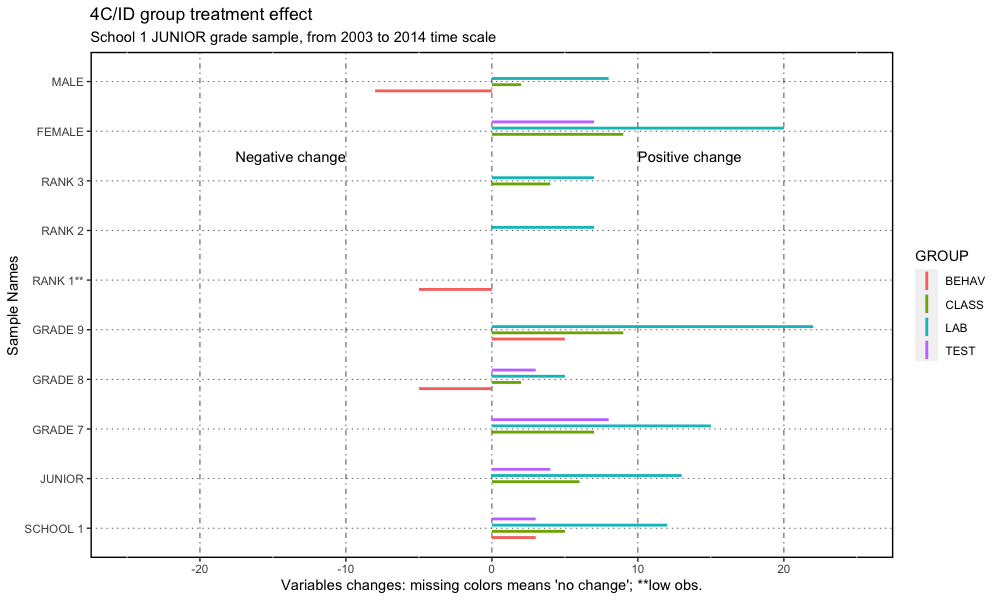

# WELCOME

This is a **`Going Inductive`** learning educational strategy changing paper DRAFT roadmap[^readme-1], with one major goal: to share the work done.

[^readme-1]: This work, as well as the data, is also presented at the blog "<https://4cidchange.edublogs.org/>" and in the github repository <https://github.com/fqantonio/GoingInductive>.

This **knowledge base source** contains the results, conclusions, procedures, exploratory data analysis (EDA), data (and raw data), statistical methods, educational methodologies, learning flow and bLearning practice. Hopefully, there will be, at least, one paper based on this.

> 
> Education is the most powerful weapon which you can use to change the world.
>
>         
>                                            Nelson Mandela
> 

# ABSTRACT

These paper argues that you should, as a teacher of science and tech of young students, **move to an inductive strategy**, for the learning design flow, even in a bLearning setting or circumscribedly, for a specific class or a more practical subject. In fact, 4C/ID eLearning methodology setting has some advantages over Direct Instruction with some remarks that will be highlighted.

If you decide to do it, there will be specific impacts that need to be **accommodated**, as well as implications for the stakeholders in the learning process, policy makers and school management, that will be adressed in this roadmap.

The sample covers 12 years of teacher data assessment, in the period 2003 to 2017, with conclusions about the impact in the Learning Transfer, Lab Practice, Social Skills and Academic Results.

> **Keywords** Inductive learning strategy; 4C/ID; Direct Instruction; Learning Flow; Statistical Non-parametric Inference; Learning Transfer, Lab Practice, Social Skills and Academic Results; Cognitive Load Theory; MultiIntelligence Theory; Brain Based Learning; bLearning.

# GOALS, RESEARCH QUESTIONS and HYPOTHESIS

The **main goal** is to understand the impact of the change: from Merriënboer's Inductive Methodology Four Component Instructional (4C/ID) (van Merriënboer, Kirschner, 2007) in a bLearning setting to Direct Instruction (Merrill, 2007). 

The **research questions** that guide this analysis in four learning outcomes areas, Learning Transfer, Lab Practice, Social Skills and Academic Results: what impact for this students learning outcomes? Who benefits more? What are the pros and cons about this methodological decision? What are the implications for the stakeholders?

The **hypothesis** is that this change will have a positive impact in all of the the learning outcomes mentioned, because, it is based on the 4C/ID methodology **'brain friendly'**, that is, they are anchored on Brain Based Learning (BBL), Cognitive Load Theory (CLT), Multi-Intelligence Theory (MIT) and Multimedia Learning (ML), learning theories well established. For the stakeholders it will give some guidelines for better support the teaching work, not only in efficiency but also to improve the learning strategies and team work.

# CONTEXT and DATA

This work is based on real day-to-day teacher assessment data, for junior and junior high students of two different schools, from different regions and time periods, for the chemistry and physics subjects of the Portuguese curriculum.

The data was gathered over 12 years, in the period 2003 to 2017, and includes students **Learning Transfer**, **Lab Practice**, **Classroom Behavior** (Social Skills), and **Academic Results** using four different random variables: TEST, LAB, BEHAV and CLASS.

The **motivation** lies on the need to understand the impact of the professional strategic decision within the educational work developed (flow charts, [^readme-2]): 

> Was it worth it? Did students benefit? What can be done better? What conclusions can be drawned?

[^readme-2]: <https://cmap.ihmc.us/>

Most of the time the professional, specific, **day-to-day teacher work** data (see figure 2) is rarely or never investigated, at least, in the Portuguese educational environment. For the teachers, there is little or no time to look back and work through the data results, the qualitative remarks, or through the statistics. And, as a consequence, no robust conclusions are devised and worse, it's normal not to share it.

## Variables description

|     VARIABLE     | Description |
|:----------------:|-------------------------------------------|
| ID | Identification entry row data |
| DATE | first year of the raw sample: example: 2003/2004, lective year, is recorder with 2003 |
| SCHOOL | there are two schools, in different regions, identified by 0 (till 2008) and 1 (after 2009) |
| GENDER | Female and Male, respectively, F and M |
| LAB | scale: 0-100: laboratory practical skills assessed by observational in classroom teacher recording forms |
| BEHAV | scale: 0-100: assessed by observational in classroom teacher recording forms related to accomplishment school classroom rules and social skills |
| CLASS | 0 to 100, height average formula [^average], representing Learning Success |
|RANK | a study for student addaptation to the school system |
| GRADE | categories 0 to 6, representing, respectively, 7,8,9,10,11, 10p(technical) and 11p (Technical) school grades |
| M4CID | category 0 and 1, respectively, without 4C/ID and with 4CID;

## Time series

Figure 1 shows the variable longitudinal patterns, for the four variables, TEST, LAB, BEHAV and CLASS using box plots time series: it includes junior and junior high grade students data for both schools. 

The red vertical line shows the school change year and the blue one is the starting point for the implementation of 4C/ID strategic inductive methodology, the **treatment group**. Its clear that near each vertical line there is a change showed by the blue smooth line (polynomial local regression); around 2012, the first year of 4C/ID implementation, something happened!

The box plots in figure 1 shows not only that the samples are not normal distributed, but also they are skewed, have same outliers and are not symmetric. In general, samples are independent and, in general, non-normal: some few sample for the CLASS and TEST variables where normal distributed.

Figure 1: Boxplot time series

# METHODS

The **statistical analysis** uses R code software in the RStudio[^readme-3] IDE release and the principal method is the non-parametric inferential treatment group effect with sign-rank Wilcoxon procedure with the respective assumptions analysis: samples independence, non-normality distribution, symmetry, shape and variances. Since the majority of the samples don't have the same variances, nor the same shape and symmetry is broken, and, in some cases, there are low observations, \< 50, sample permutation test was also used.

[^readme-3]: RStudio, <https://posit.co/products/open-source/rstudio/>

# RESULTS

Looking at figure 1 it's not clear an overall positive change but figure 3 shows a more favorable result because it's not biased by the schools differences and it compares the same student level. However, the correct results should be somewhere in between [^4results]. 

[^4results]: complete results with sample obs., stats values and p-values are on the code files for now.

Figure 2 and 3 shows a resume of the **results**, for all sample, in the time period 2003 to 2017. Figures 4 and 5 show the same results but for a more reliable sample: school one for the junior grade sample (school 1 JUNIOR) in the until 2014. More reliable, because it doesn't include the school effect identified in this work, it focus just on the analysis of the junior grade students only and doesn't include a negative pattern after 2016, that seems to be an independent pattern.

The y-axis, of the graph in figure 2, shows the sample names and the x-axis presents the median differences, for variables, TEST, LAB, BEHAV and CLASS. The left of the graph present the negative changes and on the right the positive ones: the horizontal lines means that there are no changes between the treatment and the control group. The differences presented are for the median of the variables change, distinguished by colors (see legend). Figure 3 is basically the same but focuses on the variable score change to see were was the bigger change.

Figure 2: 4C/ID group treatment effect for 2003 to 2017.

Clearly, figure 2 shows that there is a overall **positive change** for the LAB variable while a **negative change** for BEHAV (except for GRADE 9, RANK 3 and FEMALE samples). Similarly for the variable TEST, except for JUNIOR HIGH,GRADE 7 and 8, RANK 1 and 3, and FEMALE, where no changes were detected. Variable CLASS shows a mixture: in the samples JUNIOR and FEMALE there is a positive change, while negative for RANK 2 and MALE and no change for the other samples.

Figure 3 presents the score change between the two groups, treatment and control. The LAB variables shows the biggest positive change while BEHAV and TEST shows the worst negative change. CLASS as a mixture behavior.

Samples groups that present more negative changes are MALE and RANK 2. On the other, FEMALE and RANK 3 show positive change.

Figure 3: 4C/ID group treatment effect variables change for all period of time: 2003 to 2017.

Figures 4 and 5 show a more favorable positive change from treatment to control group with the RANK 1 sample with less positive change. BEHAV continues to show negative change for GRADE 8, RANK 1 and MALE.

Figure 4: Results resume graph, 4C/ID treatment effect for JUNIOR grade sample of school 1 until 2014.

Figure 5 reinforce the results presented above, less favorable to sample groups GRADE 8, RANK 1 and MALE, but still, only positive changes for the entire school 1 sample and grade 9. LAB variable its what have more positive change followed by CLASS and TEST. 

Figure 5: Results resume variables change graph, 4C/ID treatment effect for JUNIOR grade sample of school 1 until 2014.

From the point of view of qualitative results, whats more important can be resumed on four points:

  1. Students show a lot of motivation for working online with a LMS MOODLE organized like a game with levels;
  2. The MOODLE environment provide moments of procedural automation;
  2. During the online period of work the teacher as more time to support students specific needs;
  3. The amount of work of planning, constructing and improving the online lessons is overwhelming for a teacher alone.

> One last comment. Intermediate results were found using other samples like school 1 and junior grade or by including school effect on the samples of school 1 and coparing with school 0. This last two images don't include a negative pattern of the BEHAV variable on the years of 2016 and 2017 (see figure 2), compare the same levell of students learning and don't have the issue of the school effect.

# CONCLUSION

> NOTE 1: **guidelines**: what impact for the students learning outcomes (four)? Who benefits more? What are the pros and cons about this methodological decision? What are the implications for the stakeholders? Was it worth it? Did students benefit? What can be done better? What conclusions can be drawned?

>NOTE 2: the conclusions presented here focus on the "mean" results between the less favorable results of figures 2 and 3 and the more favorable of figures 4 and 5.

> NOTE 3: the Direct Instruction (Merrill, 2007) instructionla design is a well established learning strategy with a overwhelming research background, with 200 years of history, some authors claim. 

Before hand, we've to considered that the comparison is made to a well developed and researched instructional design over more then 200 years, **Direct Instruction**. Any slight improve is considered very strong. So, **Overall**, as a teacher of science and tech, you should (or at least think about it) move to implement the inductive strategy as your methodology for learning because, in overall, it as a positive impact on the learning outcomes, namely, **Learning Transfer**, **academic results**, **Social Skills** with a huge impact on **lab practice**.

Students that benefit more are females, grade 9 and rank 3 (more adapted to school) while the one's that don't benefit are rank 1 (less adapted).

So, there are issues to be addressed and accommodated before and during the process, namely: 
  1. The subject to be teached as same lab practice nuclear goal? If yes, use the 4C/ID; 
  2. Most of the students are well adapted to school? If yes, use the 4C/ID methodology with some accomodations; 
  2. All the time there is a crucial need for social skills classroom management; 
  3. Acknowledge that, for the **learning transfer** assessment the gains are more modest; 
  4. Male students gain less with this change;
  5. Team work;
  6. bLearning provide more individual time interaction between student and teacher which improves student engagement.

**Bottom line**, if you don't want to take the risks, change conditional to have a class group more adapted to school or if you want to increase the lab practices skills in some subject or school context.

Another thing that has to be acknowledge by the **stakeholders** is the fact that this change is overwhelming for one teacher alone: there is a crucial need to a commited, motivated and goal-oriented team work. However, the motivation cannot came from a external decision but must be driven by a inner group necessity. 

Furthermore, **one methodology** is not a panacea for all of the learning process, there is a need of stimulating research and knowledge spread of the specific impacts of each strategy. In this work only two were considered.

# DISCUSSION

**Further research** should include the develop of the same setting in other educational contexts, national and international, in order to confirm these findings and an analysis of the reason for the behavior declining over 2016. These work should be improved by including inference analysis that take in account samples with no symmetry, difference variances and different distribution shapes. Also, there should be done a regression and cluster analysis as a way to confirm the results and conclusions presented here, like a feedback strategy.

# NOTES
