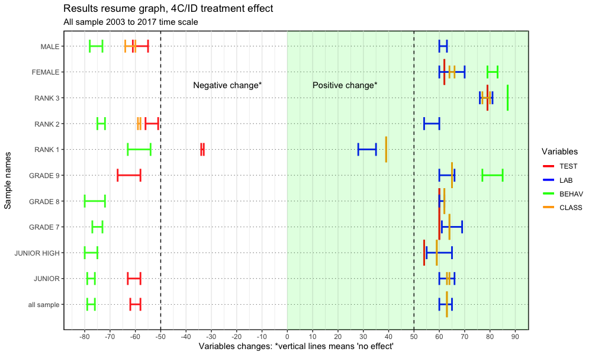

# WELCOME

This is a **`Going Inductive`** learning educational strategy changing paper DRAFT roadmap[^readme-1], with one major goal: to share the work done.

[^readme-1]: This work, as well as the data, is also presented at the blog "<https://4cidchange.edublogs.org/>" and in the github repository <https://github.com/fqantonio/GoingInductive>.

This **knowledge base source** contains the results, conclusions, procedures, exploratory data analysis (EDA), data (and raw data), statistical methods, educational methodologies, learning flow and bLearning practice. Hopefully, there will be, at least, one paper based on this.

> 
> Education is the most powerful weapon which you can use to change the world.
>
>         
>                                            Nelson Mandela
> 

# ABSTRACT

Should you, as a teacher of science and tech of young students, **move to an inductive strategy**, for the learning design flow with all the activities chronologically organized, even in a bLearning setting? In overall, the **answer is yes**, that is, 4C/ID eLearning setting has some advantages over Direct Instruction but with some remarks.

If you decide to do it, there will be specific impacts that need to be **accommodated**, as well as implications for the stakeholders in the learning process, policy makers and school management, that will be adressed in this roadmap.

The sample covers 12 years of teacher data assessment, in the period 2003 to 2017, with conclusions about the impact in the Learning Transfer, Lab Practice, Social Skills and Academic Results.

> **Keywords** Inductive learning strategy; 4C/ID; Direct Instruction; Learning Flow; Statistical Non-parametric Inference; Learning Transfer, Lab Practice, Social Skills and Academic Results; Cognitive Load Theory; MultiIntelligence Theory; Brain Based Learning; bLearning.

# GOALS, RESEARCH QUESTIONS and HYPOTHESIS

The **main goal** is to understand the impact of the change: from Merriënboer's Inductive Methodology Four Component Instructional (4C/ID)y (van Merriënboer, Kirschner, 2007) in a bLearning setting to Direct Instruction (Merrill, 2007). The **research questions** that guide this data analysis in four learning outcomes areas, Learning Transfer, Lab Practice, Social Skills and Academic Results, could be: what impact for this students learning outcomes? Who benefits more? What are the pros and cons about this methodological decision? What are the implications for the stakeholders?

The **hypothesis** is that this change will have a positive impact in all of the the learning outcomes mentioned, because, it is based on the 4C/ID methodology **'brain friendly'**, that is, they are anchored on Brain Based Learning (BBL), Cognitive Load Theory (CLT), Multi-Intelligence Theory (MIT) and Multimedia Learning (ML), learning theories well established. For the stakeholders it will give some guidelines for better support the teaching work, not only in efficiency but also to improve the learning strategies and team work.

# CONTEXT and DATA

This work is based on real day-to-day teacher assessment data, for junior and junior high students of two different schools, from different regions and time periods, for the chemistry and physics subjects of the Portuguese curriculum.

The data was gathered over 12 years, in the period 2003 to 2017, and includes students **Learning Transfer**, **Lab Practice**, **Classroom Behavior** (including Social Skills), and **Academic Results** in four different random variables: TEST, LAB, BEHAV and CLASS.

The motivation lies on the need to understand the impact of the professional strategic decision within the educational work developed (flow charts, [^readme-2]): 

> was it worth it? Did students benefit? What can be done better? What conclusions can be drawned?

[^readme-2]: <https://cmap.ihmc.us/>

Most of the time the professional, specific, **day-to-day teacher work** data (see figure 2) is rarely or never investigated, at least, in the Portuguese educational environment. For the teachers, there is little or no time to look back and work through the data results, the qualitative remarks, or through the statistics. And, as a consequence, no robust conclusions are devised and worse, it's normal not to share it.

Samples are independent and, in general, non-normal: some few sample for the CLASS and TEST variables where normal distributed.

Figure 1 shows the variable longitudinal patterns, for the four variables, TEST, LAB, BEHAV and CLASS using box plots time series: it includes junior and junior high grade students data for both schools. 

The red vertical line shows the school change year and the blue one is the starting point for the implementation of 4C/ID strategic inductive methodology, the **treatment group**. Its clear that near each vertical line there is a change showed by the blue smooth line (polynomial local regression); around 2012, the first year of 4C/ID implementation, something happened!

The box plots shows not only that the samples are not normal distributed, but also they are skewed, have same outliers and are not symmetric. 

Figure 1: Boxplot time series

# METHODS

The **statistical analysis** uses R code software in the RStudio[^readme-3] IDE release and the principal method is the non-parametric inferential treatment group effect with sign-rank Wilcoxon procedure with the respective assumptions analysis: samples independence, non-normality distribution, symmetry, shape and variances. Since the majority of the samples don't have the same variances, nor the same shape and symmetry is broken, and, in some cases, there are low observations, \< 50, sample permutation test was also used.

[^readme-3]: RStudio, <https://posit.co/products/open-source/rstudio/>

# RESULTS

Figure 2 and 3 shows a resume of the **results**, for all sample, in the time period 2003 to 2017. Figures 4 and 5 show the same results but for a more reliable sample: school one for the junior grade sample (school 1 JUNIOR) in the until 2014. More reliable, because it doesn't include the school effect identified in this work, it focus just on the analysis of the junior grade students only and doesn't include a negative pattern after 2016, that seems to be an independent pattern.

The y-axis, of the graph in figure 2, shows the sample names and the x-axis presents the median differences, for variables, TEST, LAB, BEHAV and CLASS. The left of the graph present the negative changes and on the right the positive ones: the horizontal lines means that there are no changes between the treatment and the control group. The differences presented are for the median of the variables change, distinguished by colors (see legend). Figure 3 is basically the same but focuses on the variable score change to see were was the bigger change.

Figure 2: 4C/ID group treatment effect for 2003 to 2017.

It's not clear an overall positive if considered all sample over all time period. However, considering just the school 1 and junior sample students until 2014, the positive change is clear. The correct answer should be somewhere in between.

Clearly, figure 2 shows that there is a overall **positive change** for the LAB variable while a **negative change** for BEHAV (except for GRADE 9, RANK 3 and FEMALE samples). Similarly for the variable TEST, except for JUNIOR HIGH,GRADE 7 and 8, RANK 1 and 3, and FEMALE, where no changes were detected. Variable CLASS shows a mixture: in the samples JUNIOR and FEMALE there is a positive change, while negative for RANK 2 and MALE and no change for the other samples.

Figure 3: 4C/ID group treatment effect variables change for all period of time: 2003 to 2017.

Figure 4: Results resume graph, 4C/ID treatment effect for JUNIOR grade sample of school 1 until 2014.

Figure 5: Results resume variables change graph, 4C/ID treatment effect for JUNIOR grade sample of school 1 until 2014.

> One last comment. Better results were found using the time period sample from 2009 to 2014 for just the junior grade, because it doesn't include a negative pattern of the BEHAV variable on the years of 2016 and 2017 (figure 2).

# CONCLUSION

> Guidelines
>What impact for the students learning outcomes (four)? Who benefits more? What are the pros and cons about this >methodological decision? What are the implications for the stakeholders? Was it worth it? Did students benefit? >What can be done better? What conclusions can be drawned?

The conclusions presented here focus more on the less reliable sample because it as different schools from diferent regions and different students grades: all sample from both schools with school effect included. So, **Overall**, as a teacher of science and tech, you should (or at least think about it) move to implement the inductive strategy as your methodology for learning because it improves the **Learning Transfer**, **academic results** with a huge impact on **lab practice**, except for the **Social Skills** [^readme-4] and RANK 1 students.

[^readme-4]: Is there an underlying behavioral underlying effect?

However, there are **risks and concerns** to be accommodated during the process, namely: 1. for the student less adapted (RANK 1) to the school system; 2. the classroom management referring to students behavior (see discussion); 3. in the **learning transfer** process the gains are more modest; 4. males gain less with this change.

**Bottom line**, if you don't want to take the risks, change conditionaly to have a student group more adapted to school or if you want to increase the lab practices skills in some subject or school context.

Furthermore, we've to considered that the comparison is to an well developed and researched instructional design over more then 200 years. Any slight improve is strong. Another thing that has to be acknowledge by the **stakeholders** is the fact that this change is overwhelming for a teacher alone: there is a crucial need to a commited team work. Also, one methodology is not a panacea for all of the learning process, there is a need of stimulating research and knowledge spread of the specific impacts of each strategy. In this work only two were considered.

Further research should include the why of the behavior declining over 2016 and develop the same research in other educational context national and international in order to confirm this findings.

# DISCUSSION

What strikes in a teacher practice are the doubts: did I implement the strategies correctly? Are this conclusions valuable? Are this statistical results robust, reliable and powerfull?

# NOTES
