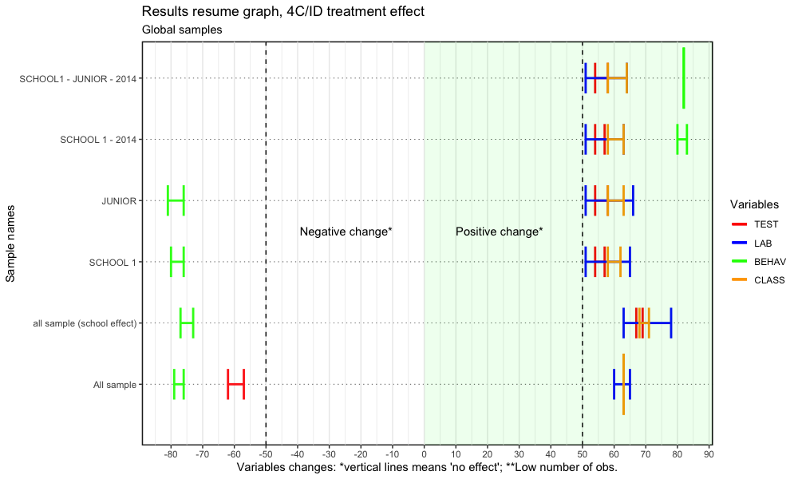

# WELCOME

This is a **`Going Inductive`** learning educational strategy changing paper DRAFT roadmap[^readme-1], with one major goal: to share the work done about the impact of a educational strategic change: from direct instruction to Four Components Instructional Design (4C/ID).

[^readme-1]: This work, as well as the data, is also presented at the blog "<https://4cidchange.edublogs.org/>" and in the github repository <https://github.com/fqantonio/GoingInductive>.

This **knowledge base source** contains the results, conclusions, procedures, exploratory data analysis (EDA), data (and raw data), statistical methods, educational methodologies, learning flow and bLearning practice. Hopefully, there will be, at least, one paper based on this.

> 
> Education is the most powerful weapon which you can use to change the world.
>
>         
>                                            Nelson Mandela
> 

# ABSTRACT

Even though the research about the impact of using specific methodologies or educational procedures is well developed, this work analyse a educational strategic change impact: from deductive to inductive methods. These paper argues that you should, as a teacher of science and tech of young students, **move to an inductive strategy**, for the learning design flow, in a bLearning setting. In fact, overall, 4C/ID eLearning methodology doesn't provide an overwhelming advantage over Direct Instruction, mostly because of the sample underlying effects, but, it is possible to say with some robustness, under the set of several sample results, that, for Lab Practice, there is a positive impact, while a less positive in the school success and learning transfer and a widespread negative impact for social skills. Groups that benefit more are female, grade 9, junior high and the students more adapted to school while the one's that don't benefit so much are males and the less adapted to school.

So, if the decision is taken, there will be specific impacts that need to be **accommodated**, as well as implications for the stakeholders in the learning process, policy makers and school management. All of Those will be adressed here.

The sample covers 12 years of teacher data assessment, in the period 2003 to 2017, with conclusions about the impact in the Learning Transfer, Lab Practice, Social Skills and Academic Results.

> **Keywords** Inductive learning strategy; 4C/ID; Direct Instruction; Learning Flow; Statistical Non-parametric Inference; Learning Transfer, Lab Practice, Social Skills and Academic Results; Cognitive Load Theory; MultiIntelligence Theory; Brain Based Learning; bLearning.

# GOALS, RESEARCH QUESTIONS and HYPOTHESIS

The **main goal** is to understand the change impact from Direct Instruction (Merrill, 2007) to Merriënboer's Inductive Methodology Four Component Instructional (4C/ID) (van Merriënboer, Kirschner, 2007) in a bLearning setting. 

This analysis spread out in four learning outcomes areas, Learning Transfer, Lab Practice, Social Skills and Academic with this **research questions** guiding the process: what impact for this students learning outcomes? Who benefits more? What are the pros and cons about this methodological strategic decision? What are the implications for the stakeholders?

The **hypothesis** is that this change will have an overall positive impact in the learning outcomes mentioned, because it's based on the 4C/ID methodology **'brain friendly'**, anchored on Brain Based Learning (BBL), Cognitive Load Theory (CLT), Multi-Intelligence Theory (MIT) and Multimedia Learning (ML), learning theories well established. For the stakeholders it will give some guidelines for better support the teaching work, not only in efficiency but also in learning strategies.

# CONTEXT and DATA

This work is based on real day-to-day teacher assessment data, for junior and junior high students of two different schools, from different regions and time periods, for the chemistry and physics subjects of the Portuguese curriculum.

The data was gathered over 12 years, in the period 2003 to 2017, and includes students **Learning Transfer**, **Lab Practice**, **Classroom Behavior** (Social Skills), and **Academic Results** using four different random variables: TEST, LAB, BEHAV and CLASS.

The **motivation** lies on the need to understand the impact of the professional strategic decision within the educational work developed (flow charts, [^readme-2]): 

> Was it worth it? Did students benefit? What can be done better? What conclusions can be drawned?

[^readme-2]: <https://cmap.ihmc.us/>

Most of the time the professional, specific, **day-to-day teacher work** data (see figure 2) is rarely or never investigated, at least, in the Portuguese educational environment. For the teachers, there is little or no time to look back and work through the data results, the qualitative remarks, or through the statistics. And, as a consequence, no robust conclusions are devised and worse, it's normal not to share it.

## Variables description

|     VARIABLE     | Description |
|:----------------:|-------------------------------------------|
| ID | Identification entry row data |
| DATE | first year of the raw sample: example: 2003/2004, lective year, is recorded as 2003 |
| SCHOOL | there are two schools, in different regions, identified by 0 (till 2008) and 1 (after 2009) |
| GENDER | Female and Male, respectively, F and M |
| TEST | scale: 0-100: learning transfer, accessed by online/presencial written tests |
| LAB | scale: 0-100: laboratory practical skills assessed by teacher recording observational forms in the classroom|
| BEHAV | scale: 0-100: social skills assessed by teacher recording observational forms in the classroom |
| CLASS | scale: 0 to 100: Learning success, weight average formula [^average] |
|RANK | categories: 1 to 3: School adaptation [^readme-3] |
| GRADE | categories 0 to 6, representing, respectively, grades 7,8,9,10,11, 10p (technical) and 11p (Technical) school grades |
| M4CID | category 0 and 1, respectively, without 4C/ID and with 4CID;

[^readme-3]: RANK1 if CLASS variable is less than 45%; RANK 3 if CLASS variable is more then 70% and RANK 2 for the rest.

## Time series

Figure 1 shows the variable longitudinal time patterns, with box plots for variables, TEST, LAB, BEHAV and CLASS: it includes junior and junior high grade students data for both schools.

The red vertical line shows the school change year and the blue one is the starting point for the implementation of 4C/ID strategic inductive methodology, the **treatment group**. Its clear that near each vertical line there is a change showed by the blue smooth line (polynomial local regression): around 2012, the first year of 4C/ID implementation, so something happened!

The box plots in figure 1 shows, not only that the samples are not normal distributed, but also they are skewed, has same outliers and are not symmetric. Further analysis confirms this and also that samples are independent, not symmetric, don't have the same variances and shapes. However, some few sample for the CLASS and TEST variables where normal distributed.

Figure 1: Box plot time series

# METHODS

The **statistical analysis**, made with R code software in the RStudio[^readme-4] IDE release and the principal method is the non-parametric inferential group treatment effect with sign-rank Wilcoxon procedure with the respective assumptions analysis: samples independence, non-normality distribution, symmetry, shape and variances. Since the majority of the samples don't have the same variances, nor the same shape and symmetry is broken, and, in some cases, there are low observations, \< 50, sample permutation test was also used.

[^readme-4]: RStudio, <https://posit.co/products/open-source/rstudio/>

# RESULTS

Figure 2 and 3 shows the median changes between control and treatment group, for variables TEST, LAB, BEHAV and CLASS (see legend). Samples are presented on the y-axis. The left of the x-axis present the negative changes and on the right the positive: the horizontal lines means that there are no changes between the treatment and the control group.

Moving up on the graph of figure 2, demonstrates that the results are turning to be more favorable to the educational 4C/ID methodology change. Looking at "all sample" it's clear that the change is positive on LAB, negative for BEHAV and TEST, and no change for CLASS. Introducing the school differences (school effect), only the negative change persist in the BEHAV variable. If the sample is reduced until 2014 only, then BEHAV starts to have a "no change"" to a "positive change", and finally, there is a positive change for all educational areas. In this sample, figure 3, the biggest positive change is for the LAB variable, CLASS and TEST are the next ones, while BEHAV has only a positive change in school 1 - 2014 sample. The correct results should be in the middle of these two descriptions [^5results], so, what is clear is a negative change in BEHAV and a positive for the LAB variable. If we include the school effect or use only the school 1 sample, there is a clear overall effect. 

[^5results]: complete results with sample obs., stats values and p-values are on the code files, for now.

Figure 2: 4C/ID group treatment effect from 2003 to 2017.

Figure 3 shows that that impact on the median change is clearly positive for the LAB variable followed by the CLASS and TEST variable and negative for the first four samples for BEHAV. Clearly, figure 4 shows that there is a overall **positive change** for the LAB variable while a **negative change** for BEHAV (except for GRADE 9, RANK 3 and FEMALE samples). Similarly for the variable TEST, except for JUNIOR HIGH,GRADE 7 and 8, RANK 1 and 3, and FEMALE, where no changes were detected. Variable CLASS shows a mixture: in the samples JUNIOR and FEMALE there is a positive change, while negative for RANK 2 and MALE and no change for the other samples.

Figure 3: 4C/ID group treatment effect from 2003 to 2017.

Figure 4 and 5 shows a resume of the **results**, with much more specific samples about GRADE, GENDER or RANK, in the time period 2003 to 2017. 

| didn't benefit | benefit more |
| --- |---| 
|the RANK 1, 2 and males|Females and RANK 3|

BEHAV and LAB confirm the pattern already identified above. CLASS, has a overall positive change except for RANK 2 and MALE samples while TEST just has negative changes except for MALE, RANK 1 and 2, GRADE 9, JUNIOR and all sample. 

Figure 4: 4C/ID group treatment effect from 2003 to 2017.

Figure 5 presents the score change between the two groups, treatment and control. The LAB variables shows the biggest positive change while BEHAV and TEST shows the worst negative change. CLASS as a mixture behavior. Samples groups that present more negative changes are MALE and RANK 2. On the other, FEMALE and RANK 3 show positive change.

Figure 4: 4C/ID group treatment effect variables change for all period of time: 2003 to 2017.

Figures 6 and 7 show a more favorable positive change from treatment to control group for all school 1 sample and specifically, a negative change for RANK 1 sample. BEHAV continues to show negative change for GRADE 8, RANK 1 and MALE.

Figure 6 reinforce the results presented above, less favorable to sample groups GRADE 8, RANK 1 and MALE, but still, positive changes for the entire school 1 sample and grade 9. LAB variable its what demonstrates a more positive change followed by CLASS and TEST. 

| benefit less | benefit more |
| --- |---| 
|the RANK 1,2 and males|Females, grade 9 (except on TEST) and RANK 3|

Figure 6: Results resume graph, 4C/ID treatment effect for JUNIOR grade sample of school 1 until 2014.

Figure 7 presents the score median change between the two groups, treatment and control: there is an overall positive change with the LAB variables showing the biggest positive change while BEHAV shows a negative change for GRADE 8, RANK 1 and MALE samples. CLASS shows the second biggest change followed by TEST and BEHAV.

Figure 7: Results resume variables change graph, 4C/ID treatment effect for JUNIOR grade sample of school 1 until 2014.

## Qualitative Results

From the point of view of qualitative results, whats more important can be resumed on four points:

  1. Students show a lot of motivation while working online with a LMS MOODLE organized with game levels;
  2. The MOODLE environment provide moments of procedural automation;
  2. During the online period of work the teacher as more time to support students specific needs;
  3. The amount of work of planning, constructing and improving the online lessons is overwhelming for a teacher alone.

> One last comment. Intermediate results were found using other samples like school 1 and junior grade or by including school effect on the samples of school 1 and comparing with school 0. This last two images don't include a negative pattern of the BEHAV variable on the years of 2016 and 2017 (see figure 2), compare the same levell of students learning and don't have the issue of the school effect.

# CONCLUSION

> NOTE 1: **guidelines**: what impact for the students learning outcomes (four)? Who benefits more? What are the pros and cons about this methodological decision? What are the implications for the stakeholders? Was it worth it? Did students benefit? What can be done better? What conclusions can be drawned?

>NOTE 2: the conclusions presented here focus on the "mean" results between the less favorable results of figures 2 and 3 and the more favorable of figures 4 and 5.

> NOTE 3: the Direct Instruction (Merrill, 2007) instructionla design is a well established learning strategy with a overwhelming research background, some authors claim, with 200 years of history. 

Before hand, we've to considered that the comparison is made to a well developed and researched instructional design over more then 200 years, **Direct Instruction**. Any slight improve is considered very strong. 

So, **Overall**, as a teacher of science and tech, you should (or at least think about it) move to implement the inductive strategy as your methodology for learning because, it as a positive impact on the learning outcomes, namely, **Learning Transfer** and **academic results**, negative impact on **Social Skills** with a huge positive impact on **lab practice**.

Students that benefit more are females, grade 9 and the more adapted to school while the one's that don't benefit are the less adapted to the school system.

So, there are issues to be addressed and accommodated before and during the process, namely: 
  1. The subject to be teached as same lab practice nuclear goal? If yes, use the 4C/ID; 
  2. Most of the students are well adapted to school? If yes, use the 4C/ID methodology with some accomodations; 
  2. All the time there is a crucial need for social skills classroom management; 
  3. Acknowledge that, for the **learning transfer** assessment the gains are more modest; 
  4. Male students gain less with this change;
  5. Team work;
  6. bLearning provide more individual time interaction between student and teacher which improves student engagement.

**Bottom line**, if you don't want to take the risks, change conditional to have a class group more adapted to school or if you want to increase the lab practices skills in some subject or school context.

Another thing that has to be acknowledge by the **stakeholders** is the fact that this change is overwhelming for one teacher alone: there is a crucial need to a commited, motivated and goal-oriented team work. However, the motivation cannot came from a external decision but must be driven by a inner group necessity. 

Furthermore, **one methodology** is not a panacea for all of the learning process, there is a need of stimulating research and knowledge spread of the specific impacts of each strategy. In this work only two were considered.

# DISCUSSION

**Further research** should include the develop of the same setting in other educational contexts, national and international, in order to confirm these findings and an analysis of the reason for the behavior declining over 2016. These work should be improved by including inference analysis that take in account samples with no symmetry, difference variances and different distribution shapes. Also, there should be done a regression and cluster analysis as a way to confirm the results and conclusions presented here, like a feedback strategy.

# REFERENCES

Felder, Richard M. ; Silverman, Linda K.; (1988), Engr. Education, 78(7), 674--681;

Gardner, Howard (2011) Frames Of Mind: The Theory Of Multiple Intelligences, ISBN-13: 978-0465024339;

Garrison, D.R.; Anderson, Terry (2003); E-Learning in the 21st Century, A framework for research and practice, RoutledgePalmer, ISBN: 978-0-415-26346-7.

Jensen, Eric (2005), Teaching with the Brain in Mind, ASCD, ISBN-10: 146600302; ISBN-13:978-1416600305;

Koretz, Daniel (2008), What Educational Testing Really Tell Us, Havard University Press, ISBN: 978-0-674-03521-8;

Mayer, Richard (editor)(2005); The Cambridge Handbook of Multimedia Learning, Cambridge University Press; ISBN: 0-521-83873-8;

Merrill, M. David (2007) A Task-Centered Instructional Strategy, Journal of Research on Technology in Education, 40:1, 5-22, DOI: 10.1080/15391523.2007.10782493

Van Merrienboer, Jeroen J. G. & Clark, Richard & Croock, Marcel. (2002). Blueprints for complex learning: The 4C/ID-model. Educational Technology Research and Development. 50. 39-61. 10.1007/BF02504993. <https://github.com/fqantonio/GoingInductive>

van Merriënboer, Jeroen J. G.; Kirschner, Paul A.; (2007) Ten Steps to Complex Learning, Routledge; 1st edition, SBN-10:0805857931; ISBN-13:978-0805857931;

Rice, William (2006); Moodle, E-Learning Course Development, Packt Publishing, ISBN: 1-904811-29-9;

Sweller, John et al. (1998) "Cognitive Architecture and Instructional Design." Educational Psychology Review 10 (1998): 251-296;

Wiley, David A. (Editor) (2002) The Instructional Use of Learning Objects, Agency for Instructional Technology Association for Educational Communications & Technology; First Edition; ISBN: 0-7842-0892-1;

# NOTES
