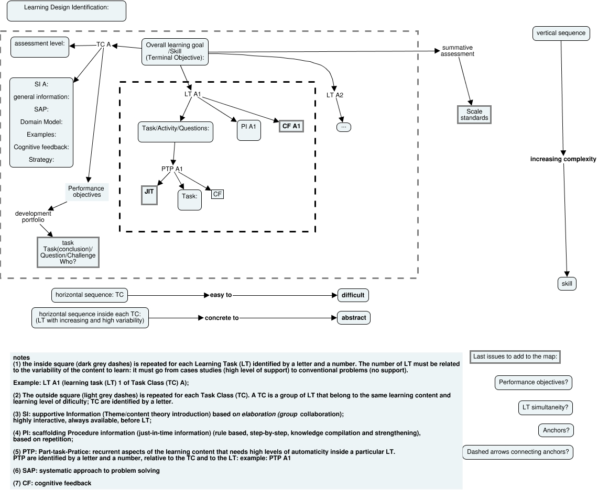

Figure 0: 4C/ID theoretical design structure: online here: https://cmapscloud.ihmc.us/viewer/cmap/213124DWG-1ZZXL6-3JRD8M

Figure 0 shows a 4C/ID general structure that was used along with the design procedure (described elsewhere in this article) with the idea of being repeated for each new task class (TC). This is the iteraction result with the practice feedback. Each TC embodies the same learning content and level of dificulty within the whole learning goals that integrates real world problems. This TC run horizontally from easy to dificult and from concrete to abstract. Each TC is motivated by a educational goal or a skill to be mastered. Since it was used a gaming strategy, same assessment level should be assigned to each TC. Connected to this is the necessity to describe performance goals as concrete as possible. Optional is the use of a portfolio to promote a reflective moment about what was learned and a short presentation to the peer group. Learning Task (LT) within each TC should run with increasing complexity and high variability. For each TC there should be prepared a supportive information (SI) always available to the student based in  elaboration theory of Reigeluth (zoom lenses metaphor) and learning-by-doing paradigm of Schank (Plass et all, 2010, p.126). For each LT there should be defined the tasks, activites or questions to be adressed with same procedural information fading and cognitive feedback with the development of the learning tasks. For the recurrent goals select Part-Tasks-Practice (PTP) for learning automation and Just-In-Time (JIT) information needed. (Van Merriënboer, Clark, Croock, 2002). This is a long process that has a lot of forward and backwards with continues feedback, sometimes from the practice implementation itself. In the end of this process, there is a need to define which LT can be done simultaneously or repeated in separate TC, or LT that should be done first and is at the next TC. Anchors are also important and crucial LT that needed to mastered before the next TC. So, performance objectives should be used to assess the student progress and decide if the student should move forward or need to master a specific objective, in that case, if he/she needs to go back. Notice that, in the case of PTP, overtraining is worth than short periodos of pratice. Also, in the case of cognitive or corrective feedback should be promptly to promote compilation. The feedback should acknowledge why is there an error and an hint to reach the goal. In the case of the cognitive feedback, which is related to non-recurrent goals, the idea is not to give an error feedback but stimulating the learner to reflect about their strategic problem solving and mental model (Van Merriënboer, Kirschner, 2007, p.117,159).

Some educational systems require summative assessments, which involve assigning a grade to a student to certify their mastery, that's why in that schematics there is a note about it.

During the process of producing activities activities for the LMS and the classroom environment, aside from the strategies, cognitive load effects were also integrated, namely, Element Interactivity, Expertise Reversal, Guidance-Fading, modality (dual channels), limited working memory capacity and learner active processing during learning, namely, selecting information, processing and integrating it in existing knowledge (Sweller in Plass el al., 2010, p.30). One very basic strategy considered in this work was the **amount of information and cognitive load** (Kalyuga in Plass el al., 2010, p.50) within each online and presential activity: the intrinsic and extraneous loads are concepts to be aware in the process of preparing and using the educational materials. Added to this is also the strategy of **gamification**: defining levels of achievement and **feedback** that took the learner in a learning path that considerers the knowledge mastered align with the expertive reversal effect, (Plass et al., 2010, p.96). **Worked-Out-examples**, **self-explanations** and **faded work-out steps** where integrated in order to tackle with the memory work load and mental model strenghening. 

Non of this was addapted to students **prior knowledge** nor **germane load** was considered. The first because each student was considered a novice to Science and Tech. Prior knowledge was considered only during the feedback process: students were allow to go further if they achieve some performance objectives. In the case of germane load, the concept was to dificult to put in place and to integrate in the process, even strategically.

A central idea, already mentioned, is the mental model aquisition that is accomplished by the Kalyuga (Plass et al. 2010, p.56) schema aquisition procedure which is very hard to achieve, whatever student in whatever content. So, schema aquisition was tackle through **automation** and a variability of problems to get to higher order of expertise by reducing cognitive load. So, small chunks of activities with repeting steps with high variability were put in place.

Added to this prinicple was the variation of contexts of the problems proposed. Multimedia principles were not forgoten, not only in the video editing but also in the animation interactiv films and simulations produced and organized by PHET animations and LMS Lesson MOODLE activity. Namely, guided activity, feedback, reflection principle (plass et all, p.166) and multimedia principle, already mentioned.
 
For the material on the LMS MOODLE, used during the class and could be used online, the Mayer and Moreno (Plass et all, 2010, p.142-148) multimedia principles for extraneous cognitive load, namely coherence, redundancy, signaling, temporal and spacial contiguity. For the intrinsic load, segmenting,
pretraining and modality were considered in the material prepared (Mayer, 2005, p.169-200).

Merril organized learning in **five prescriptive principles** (Merrill, 2002) that he noticed that they were common among several instructional design learning that, actually, are integrated in 4C/ID instructional design by Van Merriënboer  and colleagues, namely, "(a) Learning is promoted when learners are engaged in solving real-world problems. (b) Learning is promoted when existing knowledge is activated as a foundation for new knowledge. (c) Learning is promoted when new knowledge is demonstrated to the learner. (d) Learning is promoted when new knowledge is applied by the learner. (e) Learning is promoted when new knowledge is integrated into the learner's world." It is crucial to note, as highlighted by Van  Merriënboer, that his 4C/ID model effectively integrates both instructivist and constructivist methodologies across its various stages (van Merrienboer, Clark, Croock, 2002). Also important is the fact that this model **doesn't provide guidelines** for the transition from the design phase to the posterior phases of production and development. He suggest some raw media classification as primary and secondary to distinguish from supportive information to interactive media, respectively, to be used in the LMS embedded learning activities:

| Primary media | Secondary media | JIT (just-in-time) information | Part-task practice |
| -------------------- | -------------------- | -------------------- | -------------------- |
| Problem-based; simulation-based; scenario-based; | books; hypertext; lectures; video; | help; pop-up menus;ballons; | computer practice interactive media; worked-examples; completion problems |

Considering students' prior knowledge and utilizing 4C/ID effective instructional strategies to deal with short term memory work load and guidance, facilitates schema development, optimize learning outcomes and, stakeholders, including teachers, policymakers, and school administrators, can gain valuable insights to enhance teaching practices, improve learning design, and effectively, implement instructional strategies (Kirschner, 2002). Sweller (Plass et al., 2010, p.35) resume: "CLT is concerned with how information held in long-term memory of instructors can be borrowed for use by learners via schema aquisition". In 2019 this authors made a revision to the theory, after 20 years of work, reinforcing the major effects and adding new ones (Sweller, van Van Merriënboer , J.J.G., Paas, 2019). 

ARQUIVED
In all of the activities the **fading guidance** was provided until students where able to solve the problems autonomously.

All the theories underlying this work, from BBL to MI, are resumed on CLT principles and strategies that drain into 4C/ID that provide a clear and concrete procedure, used in this work, as a lighthouse, that considerer the way humans process information and how the cognitive mind works.
